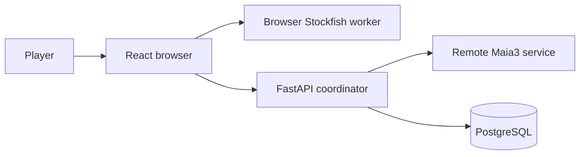

> **Scope of this guide.** `SPEC.md` is the project overview: stable product
> capabilities, system boundaries, and the paths to the authoritative detail.
> Exact schemas, request and response contracts, formulas, operational
> procedures, and design history belong in code, generated OpenAPI, migrations,
> focused documents, and tests. The detailed reference retained below is being
> reduced in sequential, reviewable passes.
>
> Within the retained detailed reference, **post-MVP** and **deferred** mark
> postponed or forward-looking work, not implemented behavior.

# Ghost Replay

## Table of contents

- [Purpose and core training loop](#purpose-and-core-training-loop)
- [Feature map and user journeys](#feature-map-and-user-journeys)
- [System architecture](#system-architecture)
- [Core domain model](#core-domain-model)
- [Major end-to-end flows](#major-end-to-end-flows)
- [Cross-cutting contracts](#cross-cutting-contracts)
- [Engineering map](#engineering-map)
- [Further reading](#further-reading)
- [Retained detailed reference](#retained-detailed-reference)
  - [8. Endpoint families](#8-endpoint-families)
  - [13. Opening weakness tracking](#13-opening-weakness-tracking)
  - [14. Analysis evidence](#14-analysis-evidence)
  - [17. Drill mode](#17-drill-mode)
  - [18. Stats and metric populations](#18-stats-and-metric-populations)

## Purpose and core training loop

Ghost Replay is a chess-training application that turns a player’s earlier
mistakes into future decision points. Rather than only presenting a completed
analysis, it can guide a future opponent move sequence toward a position that
the same player needs to practice.

1. **Play.** Start a game against an opponent.
2. **Analyze.** The browser analyzes the player’s moves during play.
3. **Capture.** An automatic opening mistake or a manually selected decision
   can become a personal training target.
4. **Replay.** A later game can steer toward that target when it is due and
   reachable.
5. **Review.** The player receives a binary pass/fail result, which updates the
   target’s review history and future priority.

## Feature map and user journeys

### Play and Ghost replay

Players start a session as White or Black. When a due, reachable personal
target exists, the Ghost can steer its side of the game toward it; otherwise
the backend serves an engine move. Reaching a stored position through a
transposition can make its downstream target reachable again.

A browser-resident Stockfish worker analyzes player moves during play. Automatic
target capture records a player move that loses at least 50cp, only in the first
10 full moves and only once per session. Players can also add a selected move to
the Ghost Move Library manually; this is separate from automatic first-target
capture and does not count against its one-target limit. When Ghost play
revisits a target, the player receives a binary pass/fail review: a pass
advances its streak and a failure resets it.

### Review and progress

After a game, players can review the game, revisit saved history, and follow
their Elo rating and summary statistics. Authentication establishes the account
boundary for games, targets, reviews, and progress.

### Openings and drills

The openings area separates White and Black repertoires, lets a player explore
a scored opening tree, and can start a drill from a selected branch. A drill is
initially unrated; after its opening objective is reached, the player may
convert it to rated normal play.

## System architecture

The browser owns the board experience, legal local move application, and live
analysis orchestration. FastAPI validates session and account boundaries,
chooses Ghost-versus-engine opponent moves, and delegates engine inference to
the remote Maia3 service. PostgreSQL holds the durable, account-scoped training
record.

| Boundary | Owns |
| --- | --- |
| Browser | Game UI, local move application, live analysis orchestration, and a local-engine fallback when FastAPI is unreachable |
| FastAPI | Account/session validation, Ghost selection, opponent decisions, and durable-write coordination |
| Maia3 | Remote engine inference when the Ghost does not supply a move |
| PostgreSQL | Per-account sessions, training evidence, and derived progress records |

During local fallback, the browser marks the move as locally sourced and Ghost
steering is unavailable for that move.

## Core domain model

A session records one played game; its moves can contribute reusable graph
evidence. The Ghost Move Library represents normalized positions and directed
moves, while a target marks a user decision at one of those positions. Each
later review is recorded separately from the target itself.

PostgreSQL also holds session and analysis evidence, rating history, and
side-scoped opening-score snapshots. The exact relational schema, constraints,
and migration history remain authoritative in the backend model and migration
layer, not in this overview.

## Major end-to-end flows

### Play, steer, and review

Starting a game creates an account-scoped session. The browser applies legal
moves locally and asks FastAPI for every opponent decision. FastAPI first looks
for a reachable, due target in that player's Ghost Move Library; when none is
available, it asks Maia3 for an engine move. The same check on every player
move means Ghost steering can resume when a transposition returns to a known
position.

The browser's analysis coordinator evaluates player moves for two decisions:
whether the first eligible early-game mistake becomes a target, and whether an
armed target review passes or fails. Automatic capture stores the pre-move
decision point and its path in the personal graph; the server enforces the
one automatic capture per session. A player can also add a selected move
manually without consuming that automatic capture.

When a Ghost move reaches its selected target, the browser arms that target for
review. The next analyzed player move records a binary pass or failure through
the review service, so later Ghost selection sees the target's updated review
history. Analysis that is absent or unusable stays ungraded; it never invents
a capture or review outcome.

### Persist, finish, and revisit

During play, the browser sends move and analysis records to the session service.
The service keeps the durable game record under the session and account
boundary; game completion records its terminal outcome and makes the saved game
available for later review.

The post-game view reads that account-owned saved session and its persisted
move analysis. History lists ended sessions visible to that account, and
selecting an item opens the same review journey. A rated terminal outcome also
persists an Elo result and returns its change for the post-game experience;
unrated and abandoned games have no rating result.

Session accuracy is a cached terminal result with a versioned population
contract. Its detailed release and operational mechanics live in
[Session-accuracy versioning](docs/session-accuracy-versioning.md) and the
[Release A runbook](docs/release_a_runbook.md) and
[Release B runbook](docs/release_b_runbook.md).

### Continue safely through disruption

If FastAPI cannot provide an opponent decision, the browser may continue with a
local-engine move labeled as a local fallback. The board remains playable, but
Ghost steering is not available for that move.

A player who rewinds a rated game first confirms a resignation of that game.
The board can then continue locally as unrated practice: it does not upload
moves or create Ghost, drill, review, or rating effects. Starting another
session clears that local practice state.

## Cross-cutting contracts

- **Identity and visibility.** FastAPI authorizes every account-scoped game,
  target, review, history, and progress read or write. A saved game becomes a
  history/review surface only when it meets the session-visibility rule.
- **Evidence boundaries.** Reusable analysis is not assumed trustworthy merely
  because it exists. Position and played-move evidence have separate grains and
  read gates; consumers degrade to permitted evidence or an unavailable result.
  [Analysis evidence](docs/architecture/analysis-evidence.md) is the focused
  contract.
- **Metrics population.** Session review, history, and progress metrics report
  only the population their owning endpoint defines. The versioned
  session-accuracy contract is linked from the flow above; exact calculation
  and API shapes remain with code and tests.

## Engineering map

| Layer | Principal responsibility |
| --- | --- |
| Browser | React UI, local chess state, live analysis coordination, session uploads, and a local-engine fallback |
| Services | FastAPI account/session coordination, Ghost and review decisions, and remote Maia3 inference |
| Data | PostgreSQL account-scoped training records, graph targets, reviews, evidence, ratings, and opening snapshots |

The browser seams are [components](src/components/),
[hooks](src/hooks/), and [services](src/services/). FastAPI route families and
their policy/model collaborators are under
[backend/app/api](backend/app/api/) and [backend/app](backend/app/); models and
migrations are the exact storage authority.

Behavioral tests at those browser workflow and backend route/policy seams
protect the training loop, rather than a duplicate specification of every
layout or payload. The generated FastAPI OpenAPI document, source types, and
tests remain authoritative for exact contracts.

## Further reading

The following sources were audited in Pass 0 and are current for their narrow
purposes:

- [Session-accuracy versioning](docs/session-accuracy-versioning.md) covers its
  release/versioning contract.
- [Opening book](docs/opening-book.md) covers the maintained opening-book input.
- [Analysis evidence](docs/architecture/analysis-evidence.md) covers the
  verified cross-cutting evidence, trust, and freshness contract.
- [Release A runbook](docs/release_a_runbook.md) and [Release B runbook](docs/release_b_runbook.md)
  are operational reading, not product or API specifications.

Additional focused references will be added only after their implementation and
authority are verified.

## Retained detailed reference

The sections below are advanced subsystem reference that later passes will
condense only after a verified overview or focused destination exists. The
compact endpoint-family map is retained as a navigation aid; route modules and
generated OpenAPI remain its exact authority.

---

## 8. Endpoint families

FastAPI route modules own endpoint handlers and their current request/response
models, validation, and status codes. The application-level
[`backend/app/main.py`](backend/app/main.py) error handler owns the standard
error envelope, including the retryability signal consumed by
[`src/utils/api.ts`](src/utils/api.ts); its behavior is pinned by
[`backend/test_error_envelope.py`](backend/test_error_envelope.py). Generated
OpenAPI is the exact public contract. This overview groups endpoints by player
workflow rather than repeating payload schemas.

| Family | Responsibility | Authority |
| --- | --- | --- |
| Authentication | Create an anonymous account, authenticate it, and claim it for cross-device use. | [`backend/app/api/auth.py`](backend/app/api/auth.py) |
| Game and session | Start and end games, serve opponent decisions, persist moves, and return saved-session analysis/opening views. | [`backend/app/api/game.py`](backend/app/api/game.py), [`backend/app/api/session.py`](backend/app/api/session.py) |
| Ghost targets and review | Capture automatic or manual training targets, list the library, and record spaced-repetition review outcomes. | [`backend/app/api/blunder.py`](backend/app/api/blunder.py), [`backend/app/api/srs.py`](backend/app/api/srs.py) |
| Analysis evidence | Resolve reusable analysis and accept approved session/analysis-board evidence through the trust policy. | [`backend/app/api/analysis.py`](backend/app/api/analysis.py), [`backend/app/api/session.py`](backend/app/api/session.py), [Analysis evidence](docs/architecture/analysis-evidence.md) |
| Openings and drills | Serve published opening scores and trees, calculate score changes, and run drill lifecycle and route checks. | [`backend/app/api/openings.py`](backend/app/api/openings.py), [`backend/app/api/drills.py`](backend/app/api/drills.py) |
| History and progress | Return saved games, ratings, achievements, and aggregate statistics for the authenticated player. | [`backend/app/api/history.py`](backend/app/api/history.py), [`backend/app/api/stats.py`](backend/app/api/stats.py) |
| Health | Report service, database, and opening-cache readiness for operations. | [`backend/app/api/health.py`](backend/app/api/health.py) |

Feature routes resolve the caller’s identity before operating on account-scoped
records. Domain rules stay with their route/service/model owners so a payload
copy here cannot become stale. See [Engineering map](#engineering-map) for the
application boundary and the generated OpenAPI document from the running
FastAPI application for exact endpoint details.

## 13. Opening weakness tracking

Opening scores turn a player's game and review evidence into a per-user,
side-specific readiness view of their repertoire. The openings page and drill picker
share an opening tree, so a player can explore a line, understand its score where
evidence is available, and choose a reachable position to practise.

Scores are published as coherent per-player-side snapshots. Reads can keep serving the
last complete snapshot while a worker checks whether game, review, registry, or trusted
analysis evidence requires a rebuild; a player with no qualifying evidence remains
unscored rather than receiving an invented score. The exact scorer, snapshot format,
freshness proof, and calibration are implementation contracts.

- [Opening score model and calibration](docs/openingscore_final.md) explains the
  readiness model and its product interpretation.
- [Opening book loader](docs/opening-book.md) describes the client-side opening-book
  lookup used for live attribution.
- [Analysis evidence contract](docs/architecture/analysis-evidence.md) defines which
  cached analysis can contribute to opening evidence.

---

## 14. Analysis evidence

Ghost Replay treats stored chess analysis as evidence, not as an interchangeable cache.
Position evidence answers which continuation is best; move evidence answers what happened
after a particular played move. Each is reused only when its profile, declared contract,
capability, and user scope permit the consuming feature to trust it.

When usable analysis is absent, stale, malformed, or insufficiently trusted, gameplay and
review use their normal worker or unavailable-result paths. They do not promote a weak
result into a canonical answer. The detailed trust, coherence, publication, and opening
freshness rules are in the [analysis evidence contract](docs/architecture/analysis-evidence.md).

---

## 17. Drill mode

Drill mode lets a player choose an opening target and practise the route to it. The server
confirms each route transition and records when the target was genuinely reached; strictness
then applies only to play after that confirmation. This keeps scripted opening moves from
being misrepresented as ordinary training evidence.

A drill can finish off route, on a post-root accuracy failure, or at a natural game end.
A root-reached or failed drill may be converted into a rated normal game while its session
remains open; otherwise it remains an unrated practice session and is excluded from
normal history and statistics.
Stopped drills can be reviewed transiently in the browser without creating a saved game
review, rating event, history entry, or statistics.

The [drill mode contract](docs/features/drill-mode.md) records the session lifecycle,
route/root evidence boundary, conversion, terminal outcomes, and transient-review policy.

---

## 18. Stats and metric populations

The stats summary intentionally uses different populations for different questions:
move quality reflects all classified player moves in visible sessions, while
game-level rates use completed games. Accuracy is a separate completed-and-scored-game
population, so an unscored game is never shown as zero accuracy.

This distinction is a product contract, not an accidental query detail. The
[stats and metrics contract](docs/features/stats-metrics.md) defines the populations,
empty-state behavior, and cached-accuracy policy; the stats service and its tests define
the exact calculations.
