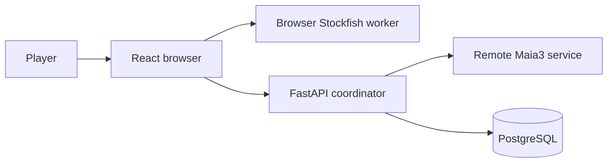

> **Scope of this guide.** `SPEC.md` is the project overview: stable product
> capabilities, system boundaries, and paths to authoritative detail. Exact
> schemas, request and response contracts, formulas, operational procedures,
> and design history belong in code, generated OpenAPI, migrations, focused
> documents, and tests.
>
> **Maintenance.** Update this overview when a stable product capability or
> system boundary changes, and keep its links limited to source-checked,
> current authorities. Do not duplicate implementation contracts here or use
> it to preserve planned, retired, or historical designs.

# Ghost Replay

## Table of contents

- [Purpose and core training loop](#purpose-and-core-training-loop)
- [Feature map and user journeys](#feature-map-and-user-journeys)
- [System architecture](#system-architecture)
- [Core domain model](#core-domain-model)
- [Major end-to-end flows](#major-end-to-end-flows)
- [Cross-cutting contracts](#cross-cutting-contracts)
- [Engineering map](#engineering-map)
- [Further reading](#further-reading)

## Purpose and core training loop

Ghost Replay is a chess-training application that turns a player’s earlier
mistakes into future decision points. Rather than only presenting a completed
analysis, it can guide a future opponent move sequence toward a position that
the same player needs to practice.

1. **Play.** Start a game against an opponent.
2. **Analyze.** The browser analyzes the player’s moves during play.
3. **Capture.** An automatic opening mistake or a manually selected decision
   can become a personal training target.
4. **Replay.** A later game can steer toward that target when it is due and
   reachable.
5. **Review.** The player receives a binary pass/fail result, which updates the
   target’s review history and future priority.

## Feature map and user journeys

### Play and Ghost replay

Players start a session as White or Black. When a due, reachable personal
target exists, the Ghost can steer its side of the game toward it; otherwise
the backend serves an engine move. Reaching a stored position through a
transposition can make its downstream target reachable again.

A browser-resident Stockfish worker analyzes player moves during play. Automatic
target capture records a player move that loses at least 50cp, only in the first
10 full moves and only once per session. Players can also add a selected move to
the Ghost Move Library manually; this is separate from automatic first-target
capture and does not count against its one-target limit. When Ghost play
revisits a target, the player receives a binary pass/fail review: a pass
advances its streak and a failure resets it.

### Review and progress

Players begin with an anonymous account, so their games, targets, reviews, and
progress are already account-scoped. They can later claim that same account
with credentials for cross-device use without losing their training record.
After a game, players can review the game, revisit saved history, and follow
their Elo rating and summary statistics.

### Openings and drills

The openings area separates White and Black repertoires, lets a player explore
a scored opening tree, and can start a drill from a selected branch. A drill is
initially unrated; after its opening objective is reached, the player may
convert it to rated normal play.

## System architecture

The browser owns the board experience, legal local move application, and live
analysis orchestration. FastAPI validates session and account boundaries,
chooses Ghost-versus-engine opponent moves, and delegates engine inference to
the remote Maia3 service. PostgreSQL holds the durable, account-scoped training
record.

| Boundary | Owns |
| --- | --- |
| Browser | Game UI, local move application, live analysis orchestration, and a local-engine fallback when FastAPI is unreachable |
| FastAPI | Account/session validation, Ghost selection, opponent decisions, and durable-write coordination |
| Maia3 | Remote engine inference when the Ghost does not supply a move |
| PostgreSQL | Per-account sessions, training evidence, and derived progress records |

During local fallback, the browser marks the move as locally sourced and Ghost
steering is unavailable for that move.

## Core domain model

A session records one played game; its moves can contribute reusable graph
evidence. The Ghost Move Library represents normalized positions and directed
moves, while a target marks a user decision at one of those positions. Each
later review is recorded separately from the target itself.

PostgreSQL also holds session and analysis evidence, rating history, and
side-scoped opening-score snapshots. The exact relational schema, constraints,
and migration history remain authoritative in the backend model and migration
layer, not in this overview.

## Major end-to-end flows

### Play, steer, and review

Starting a game creates an account-scoped session. The browser applies legal
moves locally and asks FastAPI for every opponent decision. FastAPI first looks
for a reachable, due target in that player's Ghost Move Library; when none is
available, it asks Maia3 for an engine move. The same check on every player
move means Ghost steering can resume when a transposition returns to a known
position.

The browser's analysis coordinator evaluates player moves for two decisions:
whether the first eligible early-game mistake becomes a target, and whether an
armed target review passes or fails. Automatic capture stores the pre-move
decision point and its path in the personal graph; the server enforces the
one automatic capture per session. A player can also add a selected move
manually without consuming that automatic capture.

When a Ghost move reaches its selected target, the browser arms that target for
review. The next analyzed player move records a binary pass or failure through
the review service, so later Ghost selection sees the target's updated review
history. Analysis that is absent or unusable stays ungraded; it never invents
a capture or review outcome.

### Persist, finish, and revisit

During play, the browser sends move and analysis records to the session service.
The service keeps the durable game record under the session and account
boundary; game completion records its terminal outcome and makes the saved game
available for later review.

The post-game view reads that account-owned saved session and its persisted
move analysis. History lists ended sessions visible to that account, and
selecting an item opens the same review journey. A rated terminal outcome also
persists an Elo result and returns its change for the post-game experience;
unrated and abandoned games have no rating result.

Session accuracy is a cached terminal result with a versioned population
contract. Its detailed release and operational mechanics live in
[Session-accuracy versioning](docs/session-accuracy-versioning.md) and the
[Release A runbook](docs/release_a_runbook.md) and
[Release B runbook](docs/release_b_runbook.md).

### Continue safely through disruption

If FastAPI cannot provide an opponent decision, the browser may continue with a
local-engine move labeled as a local fallback. The board remains playable, but
Ghost steering is not available for that move.

A player who rewinds a rated game first confirms a resignation of that game.
The board can then continue locally as unrated practice: it does not upload
moves or create Ghost, drill, review, or rating effects. Starting another
session clears that local practice state.

## Cross-cutting contracts

- **Identity and visibility.** FastAPI authorizes every account-scoped game,
  target, review, history, and progress read or write. A saved game becomes a
  history/review surface only when it meets the session-visibility rule.
- **Evidence boundaries.** Reusable analysis is not assumed trustworthy merely
  because it exists. Position and played-move evidence have separate grains and
  read gates; consumers degrade to permitted evidence or an unavailable result.
  [Analysis evidence](docs/architecture/analysis-evidence.md) is the focused
  contract.
- **Metrics population.** Session review, history, and progress metrics report
  only the population their owning endpoint defines. The versioned
  session-accuracy contract is linked from the flow above; exact calculation
  and API shapes remain with code and tests.

## Engineering map

| Layer | Principal responsibility |
| --- | --- |
| Browser | React UI, local chess state, live analysis coordination, session uploads, and a local-engine fallback |
| Services | FastAPI account/session coordination, Ghost and review decisions, and remote Maia3 inference |
| Data | PostgreSQL account-scoped training records, graph targets, reviews, evidence, ratings, and opening snapshots |

The browser seams are [components](src/components/),
[hooks](src/hooks/), and [services](src/services/). FastAPI route families and
their policy/model collaborators are under
[backend/app/api](backend/app/api/) and [backend/app](backend/app/); models and
migrations are the exact storage authority.

Behavioral tests at those browser workflow and backend route/policy seams
protect the training loop, rather than a duplicate specification of every
layout or payload. The generated FastAPI OpenAPI document, source types, and
tests remain authoritative for exact contracts.

## Further reading

These source-checked references provide the detailed contract for one subject;
they supplement, rather than duplicate, the implementation authorities named
in the engineering map.

- **Architecture and evidence policy:**
  [analysis evidence](docs/architecture/analysis-evidence.md).
- **Feature contracts:** [drill mode](docs/features/drill-mode.md) and
  [stats and metrics](docs/features/stats-metrics.md).
- **Opening data and scoring:** [opening-book loader](docs/opening-book.md) and
  [opening-score model and calibration](docs/openingscore_final.md).
- **Session accuracy:** [versioning policy](docs/session-accuracy-versioning.md).
- **Operational history:** [Release A](docs/release_a_runbook.md) and
  [Release B](docs/release_b_runbook.md) runbooks. These are deployment records,
  not product or API specifications.

For exact API and storage contracts, start with the
[FastAPI routes](backend/app/api/), [models](backend/app/models.py),
[migrations](backend/alembic/), and generated OpenAPI from the running service.
