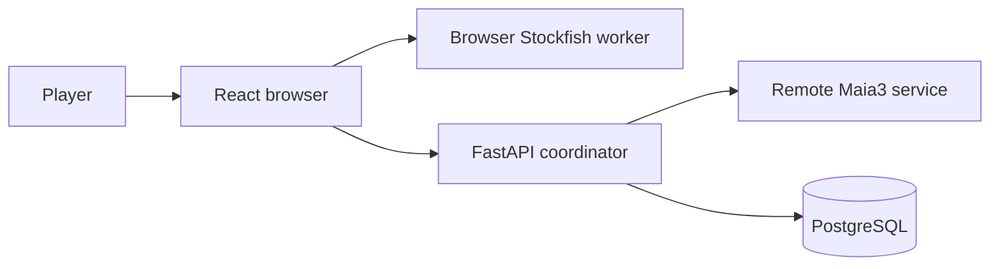

# Ghost Replay

> **Scope of this guide.** `SPEC.md` is the project overview: stable product
> capabilities, system boundaries, and paths to authoritative detail. Exact
> schemas, request and response contracts, formulas, operational procedures,
> and design history belong in code, generated OpenAPI, migrations, focused
> documents, and tests.
>
> **Maintenance.** Update this overview when a stable product capability or
> system boundary changes, and keep its links limited to source-checked,
> current authorities. Do not duplicate implementation contracts here or use
> it to preserve planned, retired, or historical designs.

## Table of contents

- [Purpose and core training loop](#purpose-and-core-training-loop)
- [Feature map and user journeys](#feature-map-and-user-journeys)
- [System architecture](#system-architecture)
- [Core domain model](#core-domain-model)
- [Major end-to-end flows](#major-end-to-end-flows)
- [Cross-cutting contracts](#cross-cutting-contracts)
- [Engineering map](#engineering-map)
- [Further reading](#further-reading)

## Purpose and core training loop

Ghost Replay is a chess-training application that turns a player’s earlier
mistakes into future decision points. Rather than only presenting a completed
analysis, it can guide a future opponent move sequence toward a position that
the same player needs to practice.

1. **Play.** Start a game against an opponent.
2. **Analyze.** The browser analyzes the player’s moves during play.
3. **Capture.** An automatically detected opening mistake or a manually
   selected decision can become a personal training target.
4. **Replay.** A later game can steer toward that target when it is due and
   reachable.
5. **Review.** The repeated decision receives a binary pass/fail result, which
   updates the target’s review history and future priority.

## Feature map and user journeys

### Play and Ghost Replay

Players start a session as White or Black. When a due, reachable personal
target exists, the Ghost can steer its side of the game toward it; otherwise
the backend serves an engine move. Reaching a stored position through a
transposition can make its downstream target reachable again.

The opponent panel follows the last move that was actually committed to the
board. A move tied to a concrete personal target is labeled **Replay Ghost**
and always offers that target's information control. Targetless structural
guidance committed during an opening drill is labeled **Opening Guide**;
ordinary engine and fallback moves keep the configured engine identity.

A browser-resident Stockfish worker analyzes player moves during play. Automatic
target capture records a player move that loses at least 50 centipawns, only in
the first 10 full moves and only once per session. Players can also add a
selected move to the Ghost Move Library manually; this is separate from
automatic first-target capture and does not count against the one-target limit.
When a later Ghost-guided game revisits a target, the player receives a binary
pass/fail review: a pass advances its streak and a failure resets it.

### Review and progress

Players begin with an anonymous account, so their games, targets, reviews, and
progress are already account-scoped. They can later claim that same account
with credentials for cross-device use without losing their training record.
After a game, players can review the game, revisit saved history, and follow
their Elo rating and summary statistics. On a browser's first visit, when
neither an auth token nor credentials exist in local storage, the root starts
the marketing surface immediately while anonymous registration completes. For
a stored authenticated identity, the root remains the marketing surface when
the account has no game-session rows; once that anonymous or claimed account
owns any game or drill session, the root shows its Stats dashboard instead.
`/stats` remains directly available regardless of account activity.

Automatic blunder, repeated-mistake, and drill-failure presentations yield to
a completed board position (checkmate or draw), so the terminal board remains
visible. A drill stop is still announced by a brief, skippable card centered
over the board, including when the stopping move also ended the game: the card
dismisses itself and replaces no position, and the repeated-mistake spotlight
takes precedence over it. Explicit post-game history navigation can still show
an earlier position and its saved annotations.

Across live play, drills, and saved-game review, the evaluation graph marks the
Lichess opening/middlegame boundary with a labeled opening band when the browser
can derive that boundary from a complete standard-start FEN sequence. The
decoration is read-only and does not replace the server's authoritative opening
evidence or score-boundary protocol.

### Openings and drills

The openings area separates White and Black repertoires, lets a player explore
a scored opening tree, and can start a drill from a selected branch. A drill is
unrated and remains outside normal game history and statistics. After stopping,
Analyze opens transient review and finalizes the drill through abandon without
creating a rating event or saved game. For registered openings, opponent guidance
continues after the target position along score-relevant reference or routing
continuations while that structural topology remains available, preserving
compatible due Ghost targets before falling back to ordinary opponent play.
Drills launched from played opening cards prefer that game's move order for the
opponent before the target, while accepting other known target-reaching routes
and resuming the preference on position-based re-entry. The mode, line, and full
opening metadata survive setup and repeat flows; see
[route steering](backend/app/drill_steering.py) and
[card-route validation](src/openings/lineageDrill.ts).
After a drill ends and opening-score
reconciliation begins, repeating that drill waits for the current session's
fresh result or a fail-open outcome; settings, analysis, and other departures
remain available. Opening-score changes are presented only for the current
session; results arriving after replacement are suppressed. The focused lifecycle
and timing contract is in
[drill mode](docs/features/drill-mode.md).

## System architecture

The browser owns the board experience, legal local move application, and live
analysis orchestration. FastAPI validates session and account boundaries,
uses Ghost steering when a target is available, and delegates other opponent
moves to the remote Maia3 service. PostgreSQL holds the durable, account-scoped
training record.

| Boundary | Owns |
| --- | --- |
| Browser | Game UI, local move application, live analysis orchestration, and a local-engine fallback when FastAPI is unreachable |
| FastAPI | Account/session validation, Ghost selection, opponent decisions, and durable-write coordination |
| Maia3 | Remote engine inference when the Ghost does not supply a move |
| PostgreSQL | Per-account sessions, training evidence, and derived progress records |

During local fallback, the browser marks the move as locally sourced and Ghost
steering is unavailable for that move.

## Core domain model

A session owns one played game and its analyzed move records. Selected paths can
also contribute to the Ghost Move Library, which stores normalized positions
and directed moves as a graph. A target marks a player decision at one of those
positions, while each later review is recorded separately from the target.

Alongside this game and training data, PostgreSQL holds reusable analysis
evidence, rating history, and side-scoped opening-score snapshots. Opening-score
generations are published atomically; a materially invalid derived coverage row
is isolated as honest no-data while valid score rows and observed navigation
edges still converge in the same current generation. Publishers serialize by
owner and color. An inactive current-row storage implementation applies exact
changes and retires the previous publication marker in the same transaction.
Every opening-score consumer serves either storage format: a reader anchors each
payload query to an exact publication marker in the same statement, so a
retirement is reported as such instead of being served as an empty result, and
the multi-statement tree read fences its marker after its bounded reads, discards
and retries an invalidated attempt, and falls back to one short read-only
snapshot. Legacy snapshots remain the production default pending release
qualification. Storage conversion preserves scoring and evidence identity.
The exact relational
schema, constraints, and migration history remain authoritative in the backend
model and migration layer, not in this overview.

Opening Coverage is the depth-weighted breadth of opening positions visited in
live play. It follows the player's chosen structural routes once a structural
choice exists, retains known breadth when the only choice was off-book, retains
known opponent breadth, shares normalized-position credit across transpositions,
and treats off-book continuations as one terminal branch. The
validated generated transposition artifact is therefore an immutable input to
both score-cache identity and browsing; scoring fails closed if that input is
missing or incompatible, while browsing may explicitly fall back to the base
book. Games remains a distinct descendant-session count rather than a Coverage
numerator.

## Major end-to-end flows

### Play, steer, and review

Starting a game creates an account-scoped session. The browser applies legal
moves locally and asks FastAPI for every opponent decision. FastAPI first looks
for a reachable, due target in that player's Ghost Move Library; when none is
available, it asks Maia3 for an engine move. The same check on every player
move means Ghost steering can resume when a transposition returns to a known
position.

Opponent decisions preserve their served move, target, and SRS snapshot on retry.
Legacy snapshots are projected to the current response schema, omitting only the
retired broad rolling opportunity/reach fields while preserving every surviving
value and leaving stored history intact. SRS continues to use broad since-review
evidence and the targeted-session reach rate. The response contract lives in
[`backend/app/api/game.py`](backend/app/api/game.py) and
[`backend/app/api/blunder.py`](backend/app/api/blunder.py); replay preservation is
covered by [`backend/test_opponent_decision_record.py`](backend/test_opponent_decision_record.py).
Rolling back across that field removal reintroduces the retired fields as zero
defaults on replayed decisions; that caveat is recorded in
[`docs/migration-deploy-runbook.md`](docs/migration-deploy-runbook.md).

Optional SRS write observations distinguish committed evidence mutations from
worker/repair failures and use a post-commit database clock bound. Private
per-session observations expire; reporting and the read-only retention census
export aggregates. Collection does not change evidence retention or select a
mutation deadline. Deployment coverage, expiry and the observation procedure live
in [`backend/scripts/OBSERVE_SRS_WRITES.md`](backend/scripts/OBSERVE_SRS_WRITES.md).

Practice opportunity evidence has a stable mutability boundary. A global policy
selects how long a session's broad opportunity evidence stays writable, and each
user carries a permanent prefix marking how far that evidence has actually been
folded into per-blunder retained totals. Uploads, the deferred evidence worker
and every repair mode refuse to rewrite evidence past that boundary, deciding by
database clock after they hold their locks; lengthening the window cannot reopen
what the prefix already covers. Retained totals and live rows are read together,
so a blunder's counters do not change when its rows are folded, and reviews stay
accepted at every session age. Evidence stops being writable at the window's
end; a separate grace interval is the drain the compactor waits out on top of
it, never an extension of writability. Freezing and cleanup are separate,
disabled switches behind a verified backfill — every blunder carrying both a
retained-totals row and a current review basis, checked by query rather than
assumed from the migration — so shipping the storage changes no current
behavior. Deleting a whole user's training history remains possible under an
administrative, owner-scoped purge. The storage and guards live in
[`backend/app/opportunity_retention.py`](backend/app/opportunity_retention.py),
[`backend/app/opportunity_store.py`](backend/app/opportunity_store.py) and
[`backend/app/opportunity_purge.py`](backend/app/opportunity_purge.py); the
lifecycle contract is covered by
[`backend/test_opportunity_retention.py`](backend/test_opportunity_retention.py)
and
[`backend/test_opportunity_lifecycle_pg.py`](backend/test_opportunity_lifecycle_pg.py),
with the boundary and purge reference in
[`backend/scripts/RETAIN_SRS_OPPORTUNITIES.md`](backend/scripts/RETAIN_SRS_OPPORTUNITIES.md).

Retention can remove a practice target, but it never fails an opponent move.
Publishing a new target and folding a user's evidence serialize on that user's
retention state row, so no unlocked check can authorize a target: publication
holds the row while it re-reads policy, prefix and database time and records its
decision, and folding gives way rather than waiting. When the interlock, the
mutation boundary or the counter reader refuses, the request drops the target and
still serves a recorded legal move — a structural drill move where one exists,
otherwise the ordinary engine move, with a deterministic local one as the floor if
the engine cannot answer either — with target fields cleared and retries replaying it
unchanged. The reason is internal
diagnostics only; responses carry no new field or state. The interlock is in
[`backend/app/srs_target_admission.py`](backend/app/srs_target_admission.py) and
the move floor in
[`backend/app/opponent_move_controller.py`](backend/app/opponent_move_controller.py),
covered by
[`backend/test_srs_target_publication.py`](backend/test_srs_target_publication.py)
and
[`backend/test_srs_target_publication_pg.py`](backend/test_srs_target_publication_pg.py).

Folding that evidence is one atomic transfer with a finite way back. A bounded
batch is selected, its exact original facts are exported and verified off disk
before any lock is taken, and a single short transaction then re-reads policy,
prefix and database time after its locks, rechecks the batch against the database
rather than against its own export, adds the retained totals, deletes exactly the
validated rows, records a manifest and advances the prefix and the targeted
watermark. Every acquisition is non-blocking, so contention means skipping a user
rather than waiting; batches are bounded, adapt downward under time pressure and
are abandoned whole if a whole-transaction deadline expires, with a connection
discarded rather than returned holding locks. Pairs an eligible current target
still needs are retained, leaving holes that later sweeps revisit, and a folded
pair cannot be recreated by any repair path. For a fixed window after the first
deletion anywhere, a restore puts the exact rows back alongside intervening
reviews, writes and purges, and a rollback that leaves nothing folded stops that
clock rather than spending it, so a rehearsal does not consume the window a later
rollout needs; after the window, both restoring and a raw-history schema
downgrade refuse, and the exports and manifests expire rather than becoming an
archive. Recurring scheduling is separate and not yet present, and nothing folds
until the disabled cleanup switch is turned on. The transfer, its recovery and
the operator entry point are in
[`backend/app/opportunity_fold.py`](backend/app/opportunity_fold.py),
[`backend/app/opportunity_fold_export.py`](backend/app/opportunity_fold_export.py),
[`backend/app/opportunity_fold_recovery.py`](backend/app/opportunity_fold_recovery.py)
and
[`backend/scripts/fold_srs_opportunities.py`](backend/scripts/fold_srs_opportunities.py),
covered by
[`backend/test_opportunity_compaction.py`](backend/test_opportunity_compaction.py),
[`backend/test_opportunity_compaction_pg.py`](backend/test_opportunity_compaction_pg.py)
and
[`backend/test_opportunity_compaction_migration.py`](backend/test_opportunity_compaction_migration.py),
with the fold and recovery reference in
[`backend/scripts/RECOVER_SRS_FOLD.md`](backend/scripts/RECOVER_SRS_FOLD.md).

New targeted decisions also atomically preserve each session/target's latest
served time in compact facts. Targeted counters can read those facts after a
verified backfill, while reached evidence remains current and mutable. Decision
envelopes remain the default reader source; expiry and deletion are inactive.
The source handoff and verification procedure lives in
[`backend/scripts/RETAIN_OPPONENT_DECISIONS.md`](backend/scripts/RETAIN_OPPONENT_DECISIONS.md).

A bounded maintenance job can prune replay envelopes past their session deadline
and targeting facts past the counter window, both with an insurance margin and
both retaining at the exact boundary. It is driven by the envelopes that are
still stored rather than by the history of expired sessions, so an emptied
session stops costing anything, and it works in short locked batches that skip
rows a live request holds and never lock a parent session. Deletion is disabled
by default and additionally refused until the counter reader has been switched
off the rows being deleted and an operator records an activation instant that the
database clock has passed; the default run is read-only and reports the backlog
it would remove. Facts survive their own envelopes by the
whole counter window, and cleanup never writes one, so pruning cannot resurrect
expired targeting. The job lives in
[`backend/app/opponent_cleanup.py`](backend/app/opponent_cleanup.py) with the
operator entry point
[`backend/scripts/retain_opponent_decisions.py`](backend/scripts/retain_opponent_decisions.py);
its contract is covered by
[`backend/test_opponent_decision_retention.py`](backend/test_opponent_decision_retention.py),
and the rollout, activation and rollback limits are in the runbook above.

The browser's analysis coordinator evaluates player moves for two decisions:
whether the first eligible early-game mistake becomes a target, and whether an
armed target review passes or fails. Automatic capture stores the pre-move
decision point and its path in the personal graph; the server enforces the
one automatic capture per session. A player can also add a selected move
manually without consuming that automatic capture.

When a Ghost move reaches its selected target, the browser arms that target for
review. The next analyzed player move records a binary pass or failure through
the review service, so later Ghost selection sees the target's updated review
history. Analysis that is absent or unusable stays ungraded; it never invents
a capture or review outcome.

### Persist, finish, and revisit

During play, the browser uploads analyzed move records as structured JSON to
`POST /api/session/{session_id}/moves`. In a separate completion request, it
sends the terminal result and PGN to `POST /api/game/end`. This split lets
analytics consume structured move fields directly instead of reparsing PGN
comments. The service keeps both forms of the game record under the session and
account boundary, and game completion makes the saved game available for later
review.

Boundary-capable browsers also stamp an explicit phase-observation protocol on
move uploads. A raw postmove FEN that satisfies the Lichess middlegame predicate
is only a scheduling hint. After the coordinator has server acknowledgements
for every move in that prefix, FastAPI replays the bounded canonical line and
stores the exact opening/middlegame boundary. Once the before-session baseline is
also durable, a startup-read switch may publish an opaque reconciliation token
and schedule a private active-session score calculation. The switch defaults off
and invalid values fail closed.

The live calculation overlays exactly the proven opening prefix onto durable
historical evidence without admitting the active session to the shared evidence
graph, replay cache, or calibration inputs. Only a result still bound to the
current marker, line revision, prefix digest, evidence/cache snapshot, and token
may replace the existing opening-card score slot. A takeback retracts that
ownership; terminalization always supersedes it with the ordinary full-line,
target-aware reconciliation. Failures remain pending and fall back to terminal
behavior without delaying play or completion. Existing aggregate boundary
telemetry remains a diagnostic rollout signal rather than a publication gate.

An active unrated takeback is available only while the coordinator owns a
writable, synchronized upload epoch. Once accepted, it rewinds the board
immediately and also replaces the durable move branch. A stopped drill or
fail-closed upload epoch disables the control instead of accepting a local-only
rewind. The browser pauses uploads behind a server-owned line revision while
FastAPI performs one truncation and advances that revision; the advance fences
any older upload from restoring the abandoned tail. The client does not retry
or negotiate an ambiguous transition. It keeps uploads and further takebacks
paused until reload or a new session, while local play and analysis may
continue. Terminal actions never wait for that transition: an unknown or stale
revision causes the terminal transaction to discard move-row evidence and
advance the fence before completing. Terminal uploads are checked
as a complete standard-start line, but a failed proof remains advisory for raw
persistence while failing closed for opening evidence. Fresh replay applies
that fail-closed gate only after a terminal writer durably marks that row
reconciliation ran; historical sessions the boundary never covered retain
their prior evidence behavior. The exact revision, race, proof, and terminal
degradation contract is in
[Session move-line revisions](docs/session-move-lines.md).
Both normal game completion and a drill's natural terminal result reconcile a
verified missing PGN tail before exposing that session to opening evidence.

The post-game view reads that account-owned saved session and its persisted
move analysis. History lists ended sessions visible to that account, and
selecting an item opens the same review journey. A rated terminal outcome also
persists an Elo result and returns its change for the post-game experience;
unrated and abandoned games have no rating result.

When a regular game ends, the play surface itself summarizes the outcome before
the player leaves it: the banner gathers that rating change, the session
accuracy once it resolves, and one line per opening whose score moved, above the
post-game actions. It reports only what is measurable — an unresolved accuracy
or an opening whose score did not move is omitted rather than shown as zero —
and it repeats the same opening numbers the lineage badges carry rather than
replacing them. Drills keep their own end-of-drill actions and no such summary.

Session accuracy is a cached terminal result with a versioned population
contract. Its detailed release and operational mechanics live in
[Session-accuracy versioning](docs/session-accuracy-versioning.md) and the
[Release A runbook](docs/release_a_runbook.md) and
[Release B runbook](docs/release_b_runbook.md).

### Continue safely through disruption

If FastAPI cannot provide an opponent decision, the browser may continue with a
local-engine move labeled as a local fallback. The board remains playable, but
Ghost steering is not available for that move.

Opponent replay and drill route proofs have a configurable, immutable session
deadline. Enforcement is disabled until the retention rollout selects and
initializes the policy. With enforcement enabled, expired normal and converted
games retain local fallback; active drills preserve their board and stop further
play and retries, offering existing restart or abandon actions. Expiry does not
invent a drill failure or root result, or expire history and earned reviews.
See [opponent retention](docs/features/opponent-retention.md) for activation and
the [drill contract](docs/features/drill-mode.md) for recovery behavior.

A player who rewinds a rated game first confirms a resignation of that game.
The board can then continue locally as unrated practice: it does not upload
moves or create Ghost targets, drill progress, reviews, or rating effects.
Starting another session clears that local practice state.

By contrast, rewinding an active unrated game or drill updates its durable line
through the revision protocol above. A stale second tab fails closed rather than
adopting another tab's branch revision; that limitation is intentional because
there is no cross-tab branch merge protocol.

## Cross-cutting contracts

- **Browser diagnostics.** The persistent debug log captures bounded, redacted
  fetch responses by default. Request bodies are opt-in, and a Metadata choice
  persists the body-capture opt-out. Capture modes, redaction limits, and log
  persistence are defined in [browser debug logging](docs/debug-logging.md).
- **Identity and recovery.** On first visit, the browser auto-registers an
  anonymous user and keeps its generated credentials and bearer token in
  origin-scoped `localStorage`; until claimed, account recovery is bound to
  that browser profile and device storage. Claiming updates the same `users`
  row (username, password hash, and anonymous flag), so its ID and all
  account-owned training data stay in place rather than being migrated. Issued
  access tokens have a seven-day lifetime. When one expires, the browser
  discards it and signs in again with the stored credentials; a separate
  refresh-token flow is intentionally deferred. The exact lifecycle is owned by
  the browser
  [auth context](src/contexts/AuthContext.tsx), the backend
  [auth routes](backend/app/api/auth.py), and
  [token security](backend/app/security.py).
- **Authorization and visibility.** FastAPI authorizes every account-scoped
  game, target, review, history, and progress read or write. A saved game becomes
  a history/review surface only when it meets the
  [session-visibility rule](backend/app/session_contracts.py).
- **Evidence boundaries.** Reusable analysis is not assumed trustworthy merely
  because it exists. Position and played-move evidence have separate grains and
  read gates; consumers degrade to permitted evidence or an unavailable result.
  [Analysis evidence](docs/architecture/analysis-evidence.md) is the focused
  contract.
- **Metrics population.** Session review, history, and progress metrics report
  only the population their owning endpoint defines. The versioned
  session-accuracy contract is linked from the flow above, and
  [Stats and metrics](docs/features/stats-metrics.md) defines the other
  population boundaries. Exact calculations and API shapes remain with code and
  tests.

## Engineering map

The frontend is React 19 with Vite and TypeScript. The backend is a Python
FastAPI service backed by PostgreSQL through SQLAlchemy and Alembic.

| Concern | Code authority |
| --- | --- |
| Frontend surfaces and workflows | [Pages](src/pages/), [components](src/components/), and [hooks](src/hooks/) |
| Browser orchestration and state | [Services](src/services/), [workers](src/workers/), [stores](src/stores/), and [contexts](src/contexts/) |
| FastAPI routes and policy | [Route modules](backend/app/api/) and their collaborators in [backend/app](backend/app/) |
| Persistence | [Models](backend/app/models.py) and [Alembic migrations](backend/alembic/) |
| Behavioral coverage | [Frontend tests](src/), [backend tests](backend/tests/), and [end-to-end tests](e2e/) |

Behavioral tests at those browser workflow and backend route/policy seams
protect the training loop, rather than a duplicate specification of every
layout or payload. The generated FastAPI OpenAPI document, source types, and
tests remain authoritative for exact contracts.

## Further reading

These source-checked references supplement, rather than duplicate, the
implementation authorities named in the engineering map.

- **Product and feature contracts:** [drill mode](docs/features/drill-mode.md)
  and [stats and metrics](docs/features/stats-metrics.md).
- **Architecture, data, and policy:**
  [frontend state management](docs/state-management.md),
  [analysis evidence](docs/architecture/analysis-evidence.md), the
  [opening-book loader](docs/opening-book.md), the
  [opening-score model and calibration](docs/openingscore_final.md), and
  [session-accuracy versioning](docs/session-accuracy-versioning.md), and
  [session move-line revisions](docs/session-move-lines.md).
- **Code-authoritative contracts:** [FastAPI routes](backend/app/api/),
  [models](backend/app/models.py), [migrations](backend/alembic/),
  [frontend API types and callers](src/utils/api.ts), tests, and generated
  OpenAPI from the running service.
- **Operational runbooks:** [Release A](docs/release_a_runbook.md) and
  [Release B](docs/release_b_runbook.md). These are deployment records, not
  product or API specifications. Production database volume headroom and its
  known bloat paths have a read-only
  [volume check](backend/scripts/MONITOR_PG_VOLUME.md) whose runbook carries its
  thresholds and its scheduling, alongside [backups](docs/backups.md).
