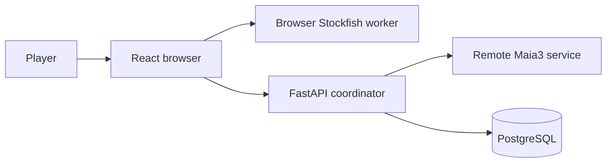

> **Scope of this guide.** `SPEC.md` is the project overview: stable product
> capabilities, system boundaries, and the paths to the authoritative detail.
> Exact schemas, request and response contracts, formulas, operational
> procedures, and design history belong in code, generated OpenAPI, migrations,
> focused documents, and tests. The detailed reference retained below is being
> reduced in sequential, reviewable passes.
>
> Within the retained detailed reference, **post-MVP** and **deferred** mark
> postponed or forward-looking work, not implemented behavior.

# Ghost Replay

## Table of contents

- [Purpose and core training loop](#purpose-and-core-training-loop)
- [Feature map and user journeys](#feature-map-and-user-journeys)
- [System architecture](#system-architecture)
- [Core domain model](#core-domain-model)
- [Major end-to-end flows](#major-end-to-end-flows)
- [Cross-cutting contracts](#cross-cutting-contracts)
- [Engineering map](#engineering-map)
- [Further reading](#further-reading)
- [Retained detailed reference](#retained-detailed-reference)
  - [8. Endpoint families](#8-endpoint-families)
  - [13. Opening weakness tracking](#13-opening-weakness-tracking)
  - [14. Analysis cache](#14-analysis-cache)
  - [17. Drill mode](#17-drill-mode)
  - [18. Stats summary populations](#18-stats-summary-populations)

## Purpose and core training loop

Ghost Replay is a chess-training application that turns a player’s earlier
mistakes into future decision points. Rather than only presenting a completed
analysis, it can guide a future opponent move sequence toward a position that
the same player needs to practice.

1. **Play.** Start a game against an opponent.
2. **Analyze.** The browser analyzes the player’s moves during play.
3. **Capture.** An automatic opening mistake or a manually selected decision
   can become a personal training target.
4. **Replay.** A later game can steer toward that target when it is due and
   reachable.
5. **Review.** The player receives a binary pass/fail result, which updates the
   target’s review history and future priority.

## Feature map and user journeys

### Play and Ghost replay

Players start a session as White or Black. When a due, reachable personal
target exists, the Ghost can steer its side of the game toward it; otherwise
the backend serves an engine move. Reaching a stored position through a
transposition can make its downstream target reachable again.

A browser-resident Stockfish worker analyzes player moves during play. Automatic
target capture records a player move that loses at least 50cp, only in the first
10 full moves and only once per session. Players can also add a selected move to
the Ghost Move Library manually; this is separate from automatic first-target
capture and does not count against its one-target limit. When Ghost play
revisits a target, the player receives a binary pass/fail review: a pass
advances its streak and a failure resets it.

### Review and progress

After a game, players can review the game, revisit saved history, and follow
their Elo rating and summary statistics. Authentication establishes the account
boundary for games, targets, reviews, and progress.

### Openings and drills

The openings area separates White and Black repertoires, lets a player explore
a scored opening tree, and can start a drill from a selected branch. A drill is
initially unrated; after its opening objective is reached, the player may
convert it to rated normal play.

## System architecture

The browser owns the board experience, legal local move application, and live
analysis orchestration. FastAPI validates session and account boundaries,
chooses Ghost-versus-engine opponent moves, and delegates engine inference to
the remote Maia3 service. PostgreSQL holds the durable, account-scoped training
record.

| Boundary | Owns |
| --- | --- |
| Browser | Game UI, local move application, live analysis orchestration, and a local-engine fallback when FastAPI is unreachable |
| FastAPI | Account/session validation, Ghost selection, opponent decisions, and durable-write coordination |
| Maia3 | Remote engine inference when the Ghost does not supply a move |
| PostgreSQL | Per-account sessions, training evidence, and derived progress records |

During local fallback, the browser marks the move as locally sourced and Ghost
steering is unavailable for that move.

## Core domain model

A session records one played game; its moves can contribute reusable graph
evidence. The Ghost Move Library represents normalized positions and directed
moves, while a target marks a user decision at one of those positions. Each
later review is recorded separately from the target itself.

PostgreSQL also holds session and analysis evidence, rating history, and
side-scoped opening-score snapshots. The exact relational schema, constraints,
and migration history remain authoritative in the backend model and migration
layer, not in this overview.

## Major end-to-end flows

### Play, steer, and review

Starting a game creates an account-scoped session. The browser applies legal
moves locally and asks FastAPI for every opponent decision. FastAPI first looks
for a reachable, due target in that player's Ghost Move Library; when none is
available, it asks Maia3 for an engine move. The same check on every player
move means Ghost steering can resume when a transposition returns to a known
position.

The browser's analysis coordinator evaluates player moves for two decisions:
whether the first eligible early-game mistake becomes a target, and whether an
armed target review passes or fails. Automatic capture stores the pre-move
decision point and its path in the personal graph; the server enforces the
one automatic capture per session. A player can also add a selected move
manually without consuming that automatic capture.

When a Ghost move reaches its selected target, the browser arms that target for
review. The next analyzed player move records a binary pass or failure through
the review service, so later Ghost selection sees the target's updated review
history. Analysis that is absent or unusable stays ungraded; it never invents
a capture or review outcome.

### Persist, finish, and revisit

During play, the browser sends move and analysis records to the session service.
The service keeps the durable game record under the session and account
boundary; game completion records its terminal outcome and makes the saved game
available for later review.

The post-game view reads that account-owned saved session and its persisted
move analysis. History lists ended sessions visible to that account, and
selecting an item opens the same review journey. A rated terminal outcome also
persists an Elo result and returns its change for the post-game experience;
unrated and abandoned games have no rating result.

Session accuracy is a cached terminal result with a versioned population
contract. Its detailed release and operational mechanics live in
[Session-accuracy versioning](docs/session-accuracy-versioning.md) and the
[Release A runbook](docs/release_a_runbook.md) and
[Release B runbook](docs/release_b_runbook.md).

### Continue safely through disruption

If FastAPI cannot provide an opponent decision, the browser may continue with a
local-engine move labeled as a local fallback. The board remains playable, but
Ghost steering is not available for that move.

A player who rewinds a rated game first confirms a resignation of that game.
The board can then continue locally as unrated practice: it does not upload
moves or create Ghost, drill, review, or rating effects. Starting another
session clears that local practice state.

## Cross-cutting contracts

- **Identity and visibility.** FastAPI authorizes every account-scoped game,
  target, review, history, and progress read or write. A saved game becomes a
  history/review surface only when it meets the session-visibility rule.
- **Evidence boundaries.** Reusable analysis is not assumed trustworthy merely
  because it exists. Position and played-move evidence have separate grains and
  read gates; consumers degrade to permitted evidence or an unavailable result.
  [Analysis evidence](docs/architecture/analysis-evidence.md) is the focused
  contract.
- **Metrics population.** Session review, history, and progress metrics report
  only the population their owning endpoint defines. The versioned
  session-accuracy contract is linked from the flow above; exact calculation
  and API shapes remain with code and tests.

## Engineering map

| Layer | Principal responsibility |
| --- | --- |
| Browser | React UI, local chess state, live analysis coordination, session uploads, and a local-engine fallback |
| Services | FastAPI account/session coordination, Ghost and review decisions, and remote Maia3 inference |
| Data | PostgreSQL account-scoped training records, graph targets, reviews, evidence, ratings, and opening snapshots |

The browser seams are [components](src/components/),
[hooks](src/hooks/), and [services](src/services/). FastAPI route families and
their policy/model collaborators are under
[backend/app/api](backend/app/api/) and [backend/app](backend/app/); models and
migrations are the exact storage authority.

Behavioral tests at those browser workflow and backend route/policy seams
protect the training loop, rather than a duplicate specification of every
layout or payload. The generated FastAPI OpenAPI document, source types, and
tests remain authoritative for exact contracts.

## Further reading

The following sources were audited in Pass 0 and are current for their narrow
purposes:

- [Session-accuracy versioning](docs/session-accuracy-versioning.md) covers its
  release/versioning contract.
- [Opening book](docs/opening-book.md) covers the maintained opening-book input.
- [Analysis evidence](docs/architecture/analysis-evidence.md) covers the
  verified cross-cutting evidence, trust, and freshness contract.
- [Release A runbook](docs/release_a_runbook.md) and [Release B runbook](docs/release_b_runbook.md)
  are operational reading, not product or API specifications.

Additional focused references will be added only after their implementation and
authority are verified.

## Retained detailed reference

The sections below are advanced subsystem reference that later passes will
condense only after a verified overview or focused destination exists. The
compact endpoint-family map is retained as a navigation aid; route modules and
generated OpenAPI remain its exact authority.

---

## 8. Endpoint families

FastAPI route modules own endpoint handlers and their current request/response
models, validation, and status codes. The application-level
[`backend/app/main.py`](backend/app/main.py) error handler owns the standard
error envelope, including the retryability signal consumed by
[`src/utils/api.ts`](src/utils/api.ts); its behavior is pinned by
[`backend/test_error_envelope.py`](backend/test_error_envelope.py). Generated
OpenAPI is the exact public contract. This overview groups endpoints by player
workflow rather than repeating payload schemas.

| Family | Responsibility | Authority |
| --- | --- | --- |
| Authentication | Create an anonymous account, authenticate it, and claim it for cross-device use. | [`backend/app/api/auth.py`](backend/app/api/auth.py) |
| Game and session | Start and end games, serve opponent decisions, persist moves, and return saved-session analysis/opening views. | [`backend/app/api/game.py`](backend/app/api/game.py), [`backend/app/api/session.py`](backend/app/api/session.py) |
| Ghost targets and review | Capture automatic or manual training targets, list the library, and record spaced-repetition review outcomes. | [`backend/app/api/blunder.py`](backend/app/api/blunder.py), [`backend/app/api/srs.py`](backend/app/api/srs.py) |
| Analysis evidence | Resolve reusable analysis and accept approved session/analysis-board evidence through the trust policy. | [`backend/app/api/analysis.py`](backend/app/api/analysis.py), [`backend/app/api/session.py`](backend/app/api/session.py), [Analysis evidence](docs/architecture/analysis-evidence.md) |
| Openings and drills | Serve published opening scores and trees, calculate score changes, and run drill lifecycle and route checks. | [`backend/app/api/openings.py`](backend/app/api/openings.py), [`backend/app/api/drills.py`](backend/app/api/drills.py) |
| History and progress | Return saved games, ratings, achievements, and aggregate statistics for the authenticated player. | [`backend/app/api/history.py`](backend/app/api/history.py), [`backend/app/api/stats.py`](backend/app/api/stats.py) |
| Health | Report service, database, and opening-cache readiness for operations. | [`backend/app/api/health.py`](backend/app/api/health.py) |

Feature routes resolve the caller’s identity before operating on account-scoped
records. Domain rules stay with their route/service/model owners so a payload
copy here cannot become stale. See [Engineering map](#engineering-map) for the
application boundary and the generated OpenAPI document from the running
FastAPI application for exact endpoint details.

## 13. Opening Weakness Tracking

The opening score system computes per-user 0-100 mastery scores (higher = better) for each opening line and surfaces them on the `/openings` page.

### 13.1 Trigger Points

- **After move uploads:** the recompute is no longer called inline at the end of `POST /api/session/:id/moves`. That handler commits `session_moves` and enqueues the evidence side effects to its [background worker](backend/app/session_evidence_scheduler.py); the worker's final step calls `request_recompute()` to schedule a **coalesced** opening-score recompute off the request path (g-yjtn). The opening-score worker then runs `recompute_opening_scores_if_needed()` and, if the user's inputs (game history or opening registry) have changed since the last batch, computes a new batch.
- **After SRS reviews:** `recompute_opening_scores_if_needed()` is called after each SRS review submission, since a review pass can change per-opening accuracy.
- **On openings page load:** reads are stale-while-revalidate, and only the paths that can afford latency block:
  - a **warm** reader (batch present) calls `request_recompute()` to schedule a coalesced background convergence and serves the cached batch immediately, never blocking;
  - the **cold live session-lineage** reader (`GET /api/session/:id/openings`, g-a5v3) never blocks: with evidence it serves the lineage with `score_status="pending"` and issues a *guarded* normal enqueue, so the client's ~3s reconciliation poll cannot re-arm the debounce and postpone the rebuild it is waiting on;
  - a **cold read with no evidence** settles as unscored and enqueues nothing, because the worker declines to write a batch for such a user;
  - the remaining **cold blocking readers** — the `/openings` family endpoints and the `/tree` registry/schema bootstrap — still block on `refresh_now()` for the one-time initial compute.

  All recompute decisions — cache miss, registry drift, stale branch keys, evidence change, decay-staleness — are consolidated in [`recompute_opening_scores_if_needed()`](backend/app/opening_cache.py), run on the single serialized worker, which returns an explicit `rebuilt`/`cached`/`no_evidence` disposition rather than a bare batch. The worker first computes a **cheap raw-input freshness digest** (pure SQL, no python-chess) and, when nothing has changed, serves the cached batch **without building the evidence overlay** — the per-session board reconstruction + Lichess phase divider only run on the non-fast paths. This keeps unchanged loads at ~10ms instead of paying the full overlay rebuild. Every enqueue on all of these paths names its producer (`OpeningScoreTrigger`), which is what makes the queue-vs-worker timing report segmentable by reader ([`backend/app/opening_cache.py`](backend/app/opening_cache.py), `docs/posthog-opening-score-queue-timing.md`).

### 13.2 Batch/Cursor Pattern

Computation runs are not overwritten in-place. Instead:

1. A new `opening_score_batches` row is created with a monotonically increasing `generation`.
2. `user_opening_scores` (named-root) rows and `opening_position_scores` (direct tree-position) rows for the new batch are written from one shared calculation, in the same transaction (see [`backend/app/opening_cache.py`](backend/app/opening_cache.py)).
3. The `opening_score_cursors` row for `(user_id, player_color)` is updated to point to the new generation.
4. Stale batches are pruned (cascading both score tables through `batch_id ON DELETE CASCADE`).

This ensures the current scores are always available atomically and reads never see a partially-computed state.

`registry_fingerprint` captures a hash of the opening registry **plus** the score-model, phase-divider, and quality-curve versions (`SCORE_MODEL_VERSION`, `DIVIDER_VERSION`, `QUALITY_VERSION`, `TAU_WC`, `TAU_CP`) and the persisted-read-model schema version (`OPENING_SCORE_CACHE_SCHEMA_VERSION`, bumped when the **set** of persisted batch read-model tables/columns changes, independent of the scoring math) at compute time. If it changes (new openings, a model/divider/curve change, or a read-model schema change), the next trigger forces a full recompute and all prior snapshots are invalidated.

`inputs_fingerprint` is the **optional full raw-input audit/release digest** (`opening_score_raw_inputs_fingerprint`). It hashes a canonical, order-independent projection of exactly the raw DB rows the evidence overlay reads — session_moves (+ game_sessions); the cache fallback's **two trusted grains** (the exact `(fen_before, move_uci)` `analysis_cache` move rows plus the columns the move-trust gate reads, AND the trusted position sources they are paired with: `position_analysis` storage winners and the legacy normalized-FEN `analysis_cache` position-fallback rows — keyed and hashed by `normalized_fen_before`, the column `resolve_trusted_positions` groups them by); ghost-target blunders/positions; and blunder_reviews — with **no overlay build and no python-chess board replay**, folded together with `registry_fingerprint` and an explicit `OPENING_EVIDENCE_INPUTS_VERSION`. Explicit/direct snapshots and release calibration compute it before their overlay, so it remains a lower-bound content identity and raw-mutation/audit oracle. Ordinary serialized-worker rebuilds omit it: their serving proof is the complete partitioned signal (`evidence_seq`, `cache_epoch`, and `scoped_shared_digest`) plus `registry_fingerprint`. They sample the counters before evidence, build the overlay, hash the exact shared fallback FEN scope, enforce equality with the move-row IDs that influenced the overlay, and accept the bundle only if both counters remain unchanged afterward; otherwise they fall back to the full digest before rebuilding the overlay. Per-user sequence drift always rebuilds without consulting the stored scope, so the operational scope may safely be the exact overlay-consumed set rather than the raw digest's broader all-candidate set. The differential acceptance property is therefore `fresh => derived overlay and score outputs unchanged`, not `fresh => broad raw digest unchanged`; a broad-only shared mutation may change the latter without affecting the exact dependency set. This is `FRESHNESS_CONTRACT_VERSION = "fresh-v2"` and produces a one-time registry-drift rebuild on rollout; no schema migration is required. `OPENING_EVIDENCE_INPUTS_VERSION` must still be bumped on any evidence-derivation semantic change the raw rows and counters cannot describe (e.g. `PASS_THRESHOLD`, quality-source precedence, the position/move trust split, FEN normalization, or phase-filter application).

### 13.3 Score Semantics

- `opening_score`: **0-100 readiness** score (higher = better), computed **directly per root** with sample sufficiency folded in through an LCB mastery term and opponent breadth folded in through the recursive score-readiness gate (`lcb_z=1.0`, `coverage_fold="gate"`, `coverage_live_threshold=1`). sm-v2-5 reports user-turn rows as `pre_fold_quality × route_coverage_fraction**0.5`; opponent-turn rows keep multiplier `1.0`, and fully covered user-turn rows are unchanged. Named-root and direct tree-position rows share this one `_direct_metrics` funnel — no confidence-weighted descendant rollup or named-root special case.
- **Tree explorer semantics:** `OpeningsTreeExplorer` is the shared chesstree.net-style **horizontal selected-branch move tree** synced to a board. Both `/openings` and the drill opening picker render this component instead of maintaining parallel tree state machines. It accepts a controlled `{ playerColor, moves, opening }` route and reports line navigation, settled canonical lines, and an optional caller-labelled expanded-card action; it owns `useOpeningsTree`, board drag/click input, keyboard backtracking, connector measurement, and all loading/error states. `/openings` remains the URL/page shell: it parses the URL (§13.5), pushes history, switches perspective, performs settled-only URL canonicalization, captures sourced analytics, and navigates Start Drill. The explorer renders a synthesized **root "whole repertoire" card** (start-position eval; `score = —`, since the tree response carries metrics only on child nodes — a deliberate follow-up) plus one column of `OpeningTreeNodeCard` per position along the selected line. **Only the deepest selected node is expanded**; the rest of the selected path is compact + highlighted. Board-drop → tree sync accepts **any legal board drag**: an in-tree frontier move selects its node, any other legal move **extends the line as a user-selected "third type" move** (`g-obh5`) the backend resolver keeps and the build loop injects as a forced-navigable node; only an illegal drag snaps back. User-selected moves are **ephemeral / route-scoped**: a node carries `is_user_selected` only as the selected move of its own column, lives only while it is part of the current `move=` line, and has null metrics on a novel position (no DB row, no eval). The hook refetches the exact prefix when the displayed response carries any such node (rather than reusing it via the prefix no-fetch path), and `buildTreeView` drops a `is_user_selected` node whose uci ≠ the column's selected move, so a line-scoped node can never leak as a navigable sibling of a shorter prefix. Five distinct states: initial-loading skeleton, no-data banner (`batch_computed_at === null` → book-only tree, still navigable), page error + Retry, per-node missing eval (em dash, never an engine search), and child-column append error + Retry (existing columns untouched). Pure transforms (display-column build, board replay, drop→uci) live in `src/openings/treeView.ts`; the response cache + stale-request guard live in the hook. Card evals are kept **white-relative** (standard +white / −black) and rendered as-is — the per-column secondary **sort** by the *column's side-to-move* eval favorability is applied on the backend (`_OpeningTreeBuilder._sort_key`), so the frontend never flips eval signs.
- **Tree layout (`g-tree-layout`, `g-epho`, `g-xuwg`):** The shared workspace is a board + a horizontally-scrolling tree canvas. Each column scrolls vertically **independently** and the tree scrolls **horizontally**; the whole desktop tree never scrolls vertically. The board is **square and sticky** (`clamp(280–380px)`, below the column floor so it never dictates column height). Connectors along the **selected path** are SVG bezier curves whose geometry is measured (`src/openings/useTreeConnectors.ts`: a rAF-coalesced `useLayoutEffect` measuring `element − canvas` rects, re-measuring on selection/column-count change, window resize, per-column scroll, and a canvas `ResizeObserver`) while **style is applied at render** from the selected child's edge metadata (`connectorStyle` in `treeView.ts`): **dashed** = book-only (`in_book && !is_observed`), **solid** = observed, **thickness** = `clamp(2, 6, 2 + log2(encounter_count + 1))`, and a **`variant` colour axis** (`default` | `selected`) where only the **selected** (third type, `is_user_selected`) edge is recoloured a distinct hue via the wrapping `<g>` `color` (so its stroke + clamp tips inherit) plus a dedicated per-explorer arrowhead `<marker>` (a marker's `currentColor` resolves against the marker, not the referencing group); book vs observed is conveyed by **thickness**, not colour, so they share the `default` connector colour. A page-level **move-type legend** (`OpeningsMetricsLegend`) names the three types alongside the score metrics, and `OpeningTreeNodeCard` flags the third type with a **"Your move"** chip (the player's own off-book *game* line keeps the distinct "Off book" chip). Origin/target endpoints clamp to the column's visible band when scrolled out, signaled by reduced opacity + a tip glyph (never by toggling the dash). At `≤720px` the board stacks above the tree and un-sticks while the tree keeps horizontal scroll with one next column peeking. In the drill picker, Tree is a body-portal, safe-area-inset near-fullscreen modal above the start overlay; its own definite flex-height chain contains the same workspace without participating in the drill panel's 30rem width or scroll/CTA sizing. Its fixed chrome contains List/Tree tabs, the shared side control, and Close; on narrow/short viewports the modal explorer body, not that chrome, may scroll vertically.
- `confidence` and `sample_size`: quantify evidence age/sparsity around the readiness score. Sample sufficiency is already folded into `opening_score`; these remain backend/API telemetry only — **not surfaced in the opening UI** (`g-9dph` dropped the Confidence tile from `OpeningTreeNodeCard` and the `/openings` legend); the tree/lineage API responses still carry them
- Branch fields: each score row includes `strongest_branch`, `weakest_branch`, and `underexposed_branch` sub-line details, persisted from the same shared calculation and read directly by the drill-down (no per-request recompute)

The score engine evaluates all named roots for one user/color as a shared DAG rather
than building a separate name-owned subtree per opening. Structural reachability
includes observed session continuations plus reference-book edges that remain before
the raw middlegame boundary. Observed edges are already phase-authoritative and are
therefore never removed by the board-local middlegame predicate.

Local mastery uses continuous move quality with a skeptical beta prior. Actual and
perfect recursive metrics are memoized by normalized FEN, so transpositions are
computed once and opening labels do not change node values. Repetition cycles are cut
deterministically by SCC and canonical FEN order, with remaining child weights
renormalized. A named root receives a score row only when its structurally reachable
set contains at least one quality observation; review-only and ghost-target-only
positions do not create prior-only rows.

**Route-exposure Coverage (`sm-v2-5`, g-coverage-book-leaf).** The global
normalized-FEN union DAG remains the structural domain, but a global structural
leaf (no reference or observed scoring child) is distinct from a terminal on one
observed session route. An opponent edge is locally exposed exactly when its exact
normalized `(parent_fen, child_fen)` `traversal_count > 0`; no later user response is
required, including when the edge is the final included opening ply before the phase
horizon. Reviews and ghost targets alone do not create exposure.

Coverage uses its own SCC cut and weights. User nodes follow only traversed user
edges, normalized by `traversal_count + rho`; unchosen and ghost-only user alternatives
add no mass. At an opponent node, every reference reply owns one bucket and all
traversed off-reference replies collectively own one additional uniformly split
bucket; without reference replies, traversed observed replies split the full mass.
Opponent popularity remains deferred. For each opponent reply of weight `w`, an
untraversed edge adds `w` available mass, while a traversed edge adds
`w·(1 + child_earned)` earned and `w·(1 + child_available)` available mass. User
nodes add no local unit and average child pairs over traversed-route weights. The
displayed fraction is `earned/available` and every memoized pair satisfies
`0 ≤ earned ≤ available ≤ 1 + earned`. Descendant mass is admitted only through a
traversed parent edge, preserving exact-edge semantics across FEN transpositions.

Zero-opportunity structural/SCC leaves and selected user routes that end before
another opponent opportunity are fully covered; a non-leaf user node with no
traversed user route is uncovered. With fixed topology/weights, traversing an
already-weighted opponent edge cannot lower Coverage, but route extension or a new
off-book bucket can reveal new denominator mass. The score-readiness gate remains
separate, so terminal exposure cannot fabricate mastery. `underexposed_branch`
selects scored named descendants whose computed Coverage is below full. Named-root
and direct-position values continue to share `_direct_metrics` exactly.

**Served report-stage axes & debug contract (`g-rescope-p4ih-fix`).** `RootCalcConfig()` serves `report_fold_p=0.5`, `report_fold_scope="user"`, and `report_self_term="keep"` under `SCORE_MODEL_VERSION="sm-v2-5"`. The historical identity (`0.0`/`all`/`keep`) remains available as the literal sm-v2-3 comparator and retains its old config fingerprint. The report-time transform lives **only in `_direct_metrics`** and touches **only `opening_score`**: `report_self_term` first selects a pre-fold quality base (the ordinary aggregate node ratio for `keep`, or the child-only ratio `100·Σw·child_natural / Σw·child_perfect` for the retained non-default diagnostic arm), then the route-exposure Coverage fold multiplies it by `coverage_fraction ** report_fold_p` exactly once for in-scope rows. Confidence, displayed coverage, and weighted_depth remain separate channels. `gate_x_cov` consumes the sm-v2-5 route-exposure child Coverage and is therefore not numerically comparable across the sm-v2-4/sm-v2-5 boundary; the served `gate` arm remains the separate readiness gate.

The display scale remains the frozen g-xnv7 scale (`A≥44`, `B≥29`, `C≥8`, `D≥2`, `F<2`; tones `alert<5`, `watch<29`). Coverage varies per opening, so the folded score is not a global transform of the old score and the boundaries cannot be algebraically remapped for sm-v2-5. Representative post-release recalibration is separate, non-blocking work.

The `NodeDebug`/`NodeDebugResponse` debug surface exposes this truthfully via four report-stage fields: `pre_fold_quality` (the base actually selected), `reported_score` (`pre_fold_quality × report_fold_multiplier`, i.e. the returned `opening_score`), `report_fold_multiplier` (`coverage_fraction ** report_fold_p` for an active in-scope row, else `1.0`), and `report_self_term_effective` — a shared `Literal["keep","drop_user","keep_fallback"]` the API rejects out-of-vocabulary spellings against. `keep_fallback` marks a `drop_user` user-turn row that could not take the child ratio (leaf, empty prepared-child set, or non-positive child denominator) and fell back to the ordinary ratio; opponent rows report `keep`. These fields are **null until the FEN is reported as its own row** and are back-filled idempotently on one shared mutable per-FEN object, so a descendant later reported on its own becomes non-null through the earlier root snapshots that reference it; a FEN only ever visited as a descendant stays null.

DB reference: [`backend/app/models.py`](backend/app/models.py)

### 13.4 Opening card contract (all surfaces, g-d65n)

Every `OpeningTreeNodeCard` — the `/openings` move-tree cards (`kind="move"`) and the `/history` & `/play` lineage cards (`kind="family"`) — leads with the **opening name** as the header/primary line and shows the **played move list** as the secondary line:

- **Header = opening name** on every surface. On `/openings` the column header still shows the selected move (`formatMoveLabel`), so the name-led card complements it; sibling move-cards in a column may share an inherited name, disambiguated by the bold last move below.
- **Secondary = the played move list** (`buildMoveListTokens`), e.g. `1.e4 c6 2.Bc4` (White plies numbered, Black plies bare), with the **last (crossing) move bold**. Compact mode **truncates** it to one line (full text in the `title`); expanded mode **wraps** it (no truncation). The synthesized `/openings` start card shows "Starting position" with no move list; a family card whose `moves` is empty shows just the name.
- The move list is the player's **actual SAN moves** for family cards (from `SessionMove`s, `GET /api/session/{id}/openings` → `OpeningLineageItem.moves`), numbered from `SessionOpeningsResponse.start_ply` (ply of `moves[0]`, computed from `move_number`/`color` so a drill starting mid-game numbers correctly). On `/openings` the list is the selected-line prefix replayed once with chess.js, always numbered from ply 1.

The `/history` analysis footer renders an opening-lineage stack (`GameOpeningLineage`) showing the openings played in the selected game, broadest to deepest, each with its score and grade. Each entry is the `OpeningTreeNodeCard` in family mode (no SAN/eval/move-type chips, no mini board) — a compact card that expands in place to the card's expanded variant.

- **Single-action card:** Each compact card is one button. Clicking it (1) expands it in place to the expanded card and (2) selects that opening's root position on the board/MoveList/graph by jumping to the game move whose `fen_after` matches the opening key. A second click — on the expanded card's full-surface collapse overlay — collapses it. If no game move matches the opening key, the board selection is a no-op (the card still toggles).
- **Board-synchronized expansion (g-m1xc):** The stack also follows the board. The **active** opening is the **last crossing whose crossing move is at or before the displayed move** (`item.moves.length - 1` — the same per-crossing index card-to-board navigation uses; lineage order and the SAN-prefix length are the authoritative played order, *not* `OpeningRoot.depth`), and that card is expanded automatically — one card at most. A position *between* two roots keeps the most recently crossed opening open; rewinding across a root switches to the preceding one; rewinding before the first crossing (or to the starting position) collapses everything. **Past the deepest crossing nothing is expanded:** a card holds the expansion only until the next crossing takes over, and the deepest crossing has no successor to hand off to, so it takes the only bound that exists — its own crossing move. Once the board moves past it (playing on during a game, or scrolling forward through one) the game has left the opening, and leaving the last card open would have it describe a position that is no longer on the board. A card with an empty `moves` list has no resolvable crossing index and is never auto-expanded — nor does it count as a successor keeping the card above it open — and a repeated `opening_key` expands only the occurrence the board is inside (occurrence key = `opening_key` + lineage index). In `/history` a **variation** is not part of the played lineage, so entering one collapses the synchronized card and returning to the main line restores it (engine-line popup previews do not move the main board and so change nothing). A manual expand/collapse is respected **until the board position changes**; the next board change **discards** it (it is not merely suspended — revisiting that same move later must not restore a collapse made there) and re-applies synchronization — deliberately transient during live play, where the next move re-expands the current opening seconds later, rather than sticky state that could leave the visible card disagreeing with the board. The synchronization prop is optional: omitted, `GameOpeningLineage` keeps its fully manual behavior.
  - **Wiring:** `GameOpeningLineage` owns the move-index → card mapping (`activeMoveIndex`: `-1` = starting position, `null` = off the played main line). `/play` passes its existing board cursor `displayedIndex` (normalizes "live/latest" to the last ply). `/history` receives the cursor from `AnalysisBoard`'s optional `onDisplayedMainlineIndexChange`, emitted from one effect over the board's canonical render state (`isInVariation ? null : effectiveIndex`), so MoveList/keyboard, graph, imperative `jumpToMove`, main-line drag continuation, a growing move list, and variation entry/exit are all covered without per-branch callbacks. `HistoryPage` holds that index only as a read-only projection for the sibling footer (reset on game switch/load, so a prior game's cursor can never select a card in the next one); the board stays the canonical owner of navigation.
- **In-card actions:** `footerAction` is the expanded card's single generic action-injection channel. It is rendered **inside** the card, raised above the collapse overlay with its clicks stopped so a tap never collapses the card; the presentational card stays router- and workflow-free. `GameOpeningLineage` injects optional **Start Drill** and **View in Openings** controls together, while `OpeningsTreeExplorer` injects the caller-labelled **Start Drill** or **Use this opening** action. Start Drill navigates `/history` to `/play` with `drillSetup: { openingKey, playerColor }`.

### 13.4.1 Opening Lineage in the live/post-game panel

The same `GameOpeningLineage` component also renders in the live game chess-panel (g-8nke). The lineage stays mounted after the game ends (gated on `gameResult`) and while a drill is stopped (gated on the active game), so the post-game score signal reads against the same cards the player saw mid-game.

- **Board navigation (g-d65n, play + post-game):** selecting a card **navigates the board** to that opening's position — matching the move whose `fen` normalizes to the opening key (`handleNavigate`), mirroring `/history`. This is wired **during live play as well as after the game ends**: it only reviews a past position (`viewIndex`), exactly like clicking a past move in the MoveList or analysis graph, so it never disturbs the live game.
- **Start Drill (g-d65n, g-vwo7):** once a game has ended (`gameResult !== null`), or while a non-converted drill is still active/stopped, the expanded card offers **Start Drill**. On `/play` it mirrors the `/openings` route-state intercept flow in place (set drill mode, clear the prior selection, seed the pending drill setup, open the setup overlay — which fetches the opening roots and resolves exactly that card) rather than navigating away. The Start action stays disabled until the requested key resolves, so a retained registered/ad-hoc selection can never be submitted during the fetch gap. Cancelling before submission leaves the current drill untouched. Submitting uses `handleNewDrill`, which abandons and immediately finalizes the prior unrated drill locally before requesting the replacement; if replacement creation fails, the setup remains open with the error but cancelling returns to the ended abandoned drill, never a playable session the backend has already ended. Regular live games and converted drills remain gated out because abandoning those rated sessions would affect Elo integrity.

- **Inline score-diff badge (g-3gmc):** After a game or drill ends, each card shows an inline score-diff badge to its right — `+N → M` (green) when the score rose, `-N → M` (red) when it fell. The badge is computed from the **rounded** before/after (the cards display rounded scores), so it renders nothing when the rounded diff is `0` (guards against a `+0`/misleading `+1` from sub-1.0 float wobble) or when the opening is **brand-new** this session (`is_new`). The badge is a sibling of the card (never inside it) and shows in both the collapsed and expanded states; in the ~240px panel the expanded card's metrics collapse to two-up to keep the card + badge inside the column. This replaces the former standalone post-game `OpeningScoreDelta` list (removed from the post-game banner and stopped-drill actions).
- **Terminal lineage refetch:** The deltas can land before the lineage exists—a resign or fast drill-stop sets the score changes **without adding a move**, and `final_full` is intentionally outside the incremental commit signal. To guarantee the cards exist to host the badges, `/play` uses a collision-free composite key encoding `(moveHistory.length, terminalDeltaPresent, uploadCommitRevision)`. The terminal presence bit therefore forces exactly one extra fetch independently of move count and incremental commits; unlike the old arithmetic sum, a revert-driven count decrease cannot cancel a simultaneous revision increase. `openingScoreChanges` is the session-gated memo derived from `openingScoreDelta` (see below), so the bit is driven by the *current* drill's own delta. A new game resets the session and clears the deltas back to null.

#### Session-scoped delta ownership (g-f3m4)

A delta is **owned by the session that earned it**, not by "whatever session is current when it arrives". The terminal endpoints serve a warm (possibly stale) delta immediately and `pollFreshOpeningDelta` reconciles it once the background recompute lands — but the player can start the next drill before that reconciliation resolves. Previously the poll led with a 1500ms sleep and bailed as soon as `sessionId` flipped, so clicking "Again" quickly destroyed drill A's diff before it was ever attempted.

- **Stamped slots.** The store holds `openingScoreDelta: { sessionId, items, origin }` (`origin: "terminal" | "reconciled"`) rather than a bare item list. The inline badges render `openingScoreDelta.items` **only** when its `sessionId` matches the live session, so a late arrival can never be misattributed to the next drill.
- **Immediate first attempt.** The poll's sleep is **trailing**: attempt 0 fires with no delay, removing the guaranteed blind window. Retries keep the ~1500ms cadence, bounded by 28 attempts and a per-request `AbortSignal.timeout`. The scoped result now runs on the immediate terminal lane with no quiet window and no dependency on an in-flight whole-graph job; warm restored-dump qualification gates both normal and drill contention p95 at `<3.0s`. The longer existing poll budget remains a conservative fallback for process-cold work, bounded lane retries, lost in-process work, and ordinary whole-batch convergence after restart (about a 40.5s sampling span, not a strict wall-clock ceiling when requests time out).
- **Supersede vs. abandon.** Starting a new game/drill **supersedes**: the old poll runs to completion, and a result for a session the player has left is routed to a bounded FIFO queue (cap 3, drop-oldest) surfaced as a **"last drill" toast** in its own board-area slot — never as the current drill's badges. `handleReset` **abandons**: it bumps a monotonic poll token, clears both slots, *and* aborts the in-flight loops. Both halves are needed — the token only invalidates a **commit**, and a loop whose server keeps answering `is_fresh: false` never reaches one, so without the abort it would burn its full attempt budget and hold a concurrency slot against the next drill. The token is re-checked **at commit time inside the store updater**, because an `AbortController` alone leaves a race in which the response resolves between the abort and the commit.
- **Departure marks the routing decision, not the session flip.** `setDepartingSession(id)` is called when the player commits to leaving — *before* the awaited `/start` round-trip, while `sessionId` is still the old one but its end screen is already gone. A delta reconciling in that window goes straight to the late queue, since committing it inline would render to nobody. This is what lets `beginSession` promote **nothing**: a delta still sitting in the slot was necessarily visible inline, and replaying it as a toast would show the same numbers twice. A failed start clears the mark, restoring inline delivery.
- **Atomic session flip.** `beginSession(newSessionId)` flips the session and clears the delta slot as one transition — a separate flip-then-clear would destroy a poll that resolved during the `/start` await.
- **Eviction is not invalidation.** The poll module caps concurrency at 3 and evicts the oldest loop, mirroring the queue's drop-oldest rule. An evicted loop is killed by its **own signal**, which the store's global token deliberately does not cover; the loop therefore re-checks `signal.aborted` *after* its `await`, since a response that fulfilled before the eviction still runs its continuation and would otherwise commit under a perfectly valid token.
- **One badge rule, two surfaces.** `src/utils/openingDeltaBadge.ts` owns `badgeFor`, shared by the inline badges and the toast, so a delta that renders nothing inline is never queued as a notification (an unrenderable head would otherwise block the drills behind it). Late notifications are acknowledged **by nonce**, never by session — acking by session could remove a later duplicate that was never shown.

#### Immediate card display (g-a5v3)

During live play the cards are derived **client-side from local move history**, so a card renders on the **same tick** as the move that crossed its root. The server round-trip is *not* causally ordered with the move — a move only becomes uploadable after local analysis resolves, and uploads then flush on an interval — so gating display on `GET /api/session/{id}/openings` made cards appear seconds late, or not until the *next* move re-armed the poll.

- **Local derivation:** `src/openings/deriveLiveLineage.ts` mirrors the backend's `played_opening_chain_indexed`: normalize each played FEN to the 4-field opening key (shared `normalize_fen`), skip keys absent from the root registry, dedupe **consecutive** repeats only, and keep each crossing's own move index (so a root reached, left, and re-reached keeps its own, longer SAN prefix). Order comes from the move-order walk, never from `OpeningRoot.depth`.
- **Root registry preload:** `useLiveOpeningLineage` loads `/api/openings/roots` once per app session (the in-flight promise is shared across mounts; a failure is *not* cached so it retries). If the registry is unavailable the hook falls back to the server lineage — i.e. the previous behavior, never a blank panel.
- **Merge, never replace:** the server response hydrates **scores only**, keyed on `(opening_key, crossing_index)` — *not* `opening_key` alone, which would hydrate both crossings of a repeated root from one row. A shorter or empty server lineage can never remove a locally visible card.
- **Causal server enrichment:** each fulfilled ordinary incremental `POST /api/session/{id}/moves` advances a transient revision on the coordinator's exact current `UploadState`. `useSessionUploadCommitRevision` exposes that revision through `useSyncExternalStore`, and `/play` includes it with move-history length and the terminal-delta presence flag in a collision-free composite `useSessionOpenings` key. The resulting authoritative `GET /openings` is ordered after the move rows commit rather than guessed with delayed upload-lag polls. Only a still-enabled success owned by the exact current upload-state object publishes: detached old-session drains, orphaned completions after a same-id restart, and requests fulfilled after `stopSessionUploads` remain silent. Rejections and aborts do not publish; a retry publishes once on its eventual current-state success. `late_eval_repair`, `final_full`, and revert uploads stay outside this channel—their score/terminal reconciliation paths remain authoritative.
- **Parity is enforced, not assumed.** The two implementations of the chain walk are pinned by a generated shared fixture (`backend/scripts/gen_opening_chain_parity_fixture.py` → `src/openings/__fixtures__/openingChainParity.json`) consumed by *both* `backend/test_opening_chain_parity.py` and `src/openings/deriveLiveLineage.parity.test.ts`. Changing either walk means regenerating the fixture and fixing the other side. Coverage includes transpositions, retained non-consecutive re-crossings, consecutive-repeat dedupe, and **both** en-passant halves — a legally capturable ep square (which stays part of the key) and a **hand-injected raw FEN** carrying an ep square that cannot legally be captured. The raw injection is necessary because python-chess's `board.fen()` *and* chess.js's `fen()` both already canonicalize an uncapturable ep square to `-`, so a fixture derived purely from move replay can never carry one — leaving the `has_legal_en_passant()` gate untested. This duplicated logic is the deliberate cost of immediacy; the alternative (persisting moves structurally before analysis) was rejected as a much larger blast radius on the move-upload contract.
- **History is unchanged:** `HistoryPage` has no live local move source and continues to use the persisted server lineage.

#### Non-blocking scores (`score_status`)

`GET /api/session/{id}/openings` previously stamped scores via `load_cached_rows`, whose **cold** branch blocks on `refresh_now` (up to 5s) — delaying the whole JSON, so cards did not render unscored, they did not render at all.

- The endpoint now uses `load_cached_rows_nonblocking` (`app/opening_cache.py`), which returns `(batch, rows, scores_pending)`. Cold: return no batch immediately, never `refresh_now`. Warm: unchanged — serve the batch and call `request_recompute` **unconditionally** (that warm enqueue is load-bearing; it is the only trigger catching evidence changes with no write-path enqueue). `load_cached_rows` itself is untouched, since other `/opening` readers depend on its blocking cold behavior.
- **Cold-with-evidence vs. genuinely unscored.** `recompute_opening_scores_if_needed` bails out *without creating a batch* when `has_opening_evidence` is false, so "no batch" alone does not mean "a batch is coming". A cold read therefore checks evidence: with evidence it is **pending** (and enqueues); with **no** evidence it is **not pending** and enqueues nothing, mirroring `ensure_opening_scores`, which likewise reports this case as settled rather than building. Without this split a first-time user — whose only game is still in progress, and so is not yet eligible evidence — would sit behind a shimmer for their whole first game while the client re-scheduled recomputes the worker would decline, with each new move resetting the attempt budget.
- The cold enqueue is **guarded on `is_recompute_scheduled`** (mirroring `ensure_opening_scores`): `request_recompute` pushes the debounced deadline to `now + quiet_window`, so an unguarded enqueue from a polling reader would repeatedly postpone the very compute it is waiting on. Re-enqueueing when nothing is scheduled also retries work lost to a worker fault.
- `score_status` is resolved **independently of whether the persisted chain is empty**, and before the empty-chain return. The client derives its own lineage locally, so it can be showing a card while this (upload-lagged) server chain is still empty; a bare `"ready"` there would strand that card on "—" with nothing enqueued and no pending status to reconcile from.
- The response carries `score_status: "ready" | "pending"`. `"pending"` means the lineage is complete but every score is null and a recompute is running. A **warm** batch is always `"ready"` even with a background refresh in flight — it is displayable, and calling stale-warm "pending" would pin a permanent spinner on the common path. The client defaults an absent field to `"ready"`, so an older backend degrades to the previous behavior.
- **Client score reconciliation** (`useSessionOpenings`): a `"pending"` status drives a bounded re-poll (~3s × 8) on every surface, including History and post-game. This is separate from the upload-commit revision: a fulfilled move upload proves durability, not that the background score recompute has finished. The interval must exceed the scheduler's 1.5s quiet window. The status is read through a **ref** and kept out of the dep array, preserving the invariant that this effect may only fetch on a timer tick, never on a dep change. On exhaustion the hook reports `"ready"` so the cards fall back to "—" instead of spinning forever. Exhaustion is keyed by an unambiguous encoding of the reconciliation **window** (`JSON.stringify([sessionId, refetchKey])`), not the session, so a later move or upload commit arms a fresh budget and can show the affordance again—keying on the session alone would leave the rest of that game permanently `"ready"`.
- **Loading affordance:** cards render a circular spinner + accessible "Score loading" label in place of the score, in both card variants, reserving the slot width so hydration does not reflow. Live, locally-derived cards are pending until their exact `(opening_key, crossing_index)` occurrence has a matching server row, with an independent 30-second bound per occurrence before falling back to `—`; later hydration still replaces that fallback. Backend `score_status: "pending"` independently covers cold-cache recomputation with its bounded reconciliation window. Both signals become an explicit per-card `scorePending` prop — never inferred from `score == null`, because a matching ready row with a null score means "genuinely unscored" and renders `—`. The **terminal score pin wins** for either signal: when a delta badge is present the pinned pre-game number is shown, never a spinner, so the badge never quotes a number that is off screen.

### 13.5 Opening Tree API (`GET /api/openings/tree`)

The chesstree.net-style horizontal move graph reads from `GET /api/openings/tree`. One request returns one hydrated **column** per position along a canonical move line, so a deep link or refresh renders in a single round trip. The endpoint does **zero per-request scoring** and **no per-request overlay rebuild**: structural shape comes from the opening graph + the persisted observed-edge read model (bounded per-parent indexed lookups), direct metrics from the persisted batch, and engine evals from `analysis_cache` (§14, via `app/tree_eval.py`). A warm read therefore scales with the rendered line/frontier size and indexed DB lookups, not with the user's total session history. The single stale-while-revalidate trigger ([`ensure_tree_cache`](backend/app/opening_cache.py)) serves a warm-fresh batch immediately while scheduling a background recompute, and **blocks** for a one-time bootstrap only when the latest batch is cold or registry/schema-stale (predating the persisted observed-edge read model) so observed moves are never hidden.

**Request.** `player_color=white|black` (required; bad color → 422). The selected line is given either as a repeated UCI param `move=e2e4&move=c7c5`, or — legacy, only when `move` is empty — as `opening=<normalized FEN>`. With neither, the line is empty (root).

**Canonicalization contract.** The response `canonical_line` is the deepest valid **legal** prefix of the request — any legal move is kept, so a move past the book/observed frontier survives as a user-selected (third type) node (`g-obh5`) instead of being truncated; the frontend caches and addresses by `(player_color, canonical_line)`.
- A **malformed** UCI token, or an `opening` FEN that fails to parse, is a client error → **422** (never a silent truncate, never a 500).
- A well-formed move **truncates** the line (canonical-URL behavior) only when it is illegal on the board (legality is checked **before** replay so a corrupt overlay edge cannot corrupt the line), lands on a position with no legal continuations (checkmate/stalemate), revisits a position (cycle), or exceeds the 80-ply ceiling. A legal move that is **not** a navigable child is **no longer** a truncation cause — it is kept as a user-selected (third type) node (`g-obh5`).
- A legacy `opening` resolves via a deterministic shortest-path book BFS (explicit visited set, UCI tie-break) **re-validated through the same move validator**, so legacy and `move` entrypoints never diverge. An `opening` that parses but is unreachable / out of graph resolves to the empty line (root), not a 404.

**Three child sets.** Per position, `_column_children ⊇ _navigable_children ⊇ _structural_children` always holds:
- `_structural_children` = observed edges (**always** — phase-authoritative) ∪ reference book children whose child is **not** a middlegame position. This is the **structural** set, identical to the scorer's domain (`opening_rootcalc._structural_children`). Only this set feeds scoring, and the transposition overlay never widens it.
- `_navigable_children` = the structural set **plus** routing-overlay edges (§17.4) whose destination is not a middlegame position, taken only when the parent is itself not a middlegame position — the overlay must never *volunteer* a move past the opening boundary (`g-openings-transpose`). Provenance is read from `overlay.children_of`, **not** `routing_children` (which unions base and overlay edges and so cannot tell them apart). An overlay edge that duplicates an observed one merges into a single card retaining its evidence.
  - **Provenance tagging is independent of that eligibility filter.** `is_transposition` is set on *any* edge the overlay carries — including one that is also observed, one crossing into the middlegame, and one out of an already-middlegame parent. Folding the tag into the filter would strip provenance from exactly those cases and render them as "Off book", i.e. as moves from the player's own games, which they are not. A node's `is_navigable` is `uci ∈ _navigable_children` **OR** the node is this column's user-selected move (a board-played legal move forced navigable for its own line only, `g-obh5`); `is_navigable` gates node-click navigation but **no longer** gates entry into `canonical_line` — any legal move (including an in-book middlegame boundary move played on the board) may enter the line as a user-selected (third type) node.
- `_column_children` = the navigable set **plus**, when the parent is itself not a middlegame, the parent's middlegame children **from the book and from the overlay alike** as **display-only, non-navigable boundary** nodes.

Transposition cards are persistent column members (they are written to the column cache and stay visible in a cached shorter-prefix view), unlike the per-line user-selected injection, which is a local copy. Their destinations join the existing **wave-two** observed-edge prefetch frontier rather than adding a third wave or per-node queries.

**Terminal reasons** (precedence, checked via the board first so a short mate is never mislabeled): `checkmate` → `stalemate` → not navigable ⇒ `opening_boundary` (a display-only middlegame book boundary) → navigable dead-end ⇒ `opening_boundary` when the child is a middlegame position else `no_children` → null. The selected position's `selected_is_terminal` / `selected_terminal_reason` are derived directly from `pos[k]`, independent of columns; a leaf deepest position yields no column `k`.

**Node hydration.** Each node carries `san`, `ply`, opening `name`/`eco` (a child without its own graph name inherits the deepest named ancestor along the line), `in_book` / `is_observed` / `is_user_selected` (a board-played legal move **outside `_navigable_children`**, valid only as its own column's selected move, `g-obh5`) / `is_transposition` (the edge comes from the routing overlay, `g-openings-transpose`) / `is_prepared`, `user_choice_count` (edge live attempts) and `encounter_count` (edge traversals), the persisted direct metrics (`opening_score`, `confidence`, `coverage`, `sample_size`, `game_count`, `last_practiced_at`; absent ⇒ no-data), `eval_cp` / `eval_mate` (**white-relative**; the card renders them as-is in the standard +white / −black convention — only the backend column sort applies the column's side-to-move favorability, the frontend never flips eval signs), `drill_opening_key` (still set only on named boundary roots, but it **no longer gates the Start Drill button** — every expanded move card is drillable; non-root / off-book cards drill via the reconstructed played line, so this field now denotes named-root identity only), and `is_selected`. In-book middlegame boundary nodes are outside the scorer domain, so their null metrics are structural-by-design.

**Move-type flags are independent, not disjoint.** `in_book`, `is_observed`, `is_transposition`, and `is_user_selected` each state one fact about the edge, and they overlap. In particular **any selected overlay edge outside `_navigable_children` carries both `is_transposition` and `is_user_selected`** — reached either by an overlay edge crossing the first middlegame boundary (in the column, displayed, not navigable) or by an overlay edge manually selected from an already-middlegame parent (not in the column at all, so it arrives via the injection path, yet `overlay.children_of` still names its provenance). Metrics follow the **destination**, not the edge's provenance: hydration is keyed by `child_fen`, so an unobserved transposition has zero *edge* counts and `is_prepared=false` but retains normal destination-position metrics whenever a row exists. **Display-only boundary cards are the exception and are enforced, not merely expected**: they sit outside the scorer domain, and a middlegame destination *can* own a cached row (reached through some other, observed move order), so hydration suppresses their scorer metrics explicitly rather than relying on the row being absent. Evals are a position property, not a scorer metric, and are still shown. Boundary membership is a property of the **position**, not of the current selection — it is derived from *persistent column member ∖ navigable set*, computed **before** the selected move is forced navigable. Deriving it from `not is_navigable` would let merely selecting a boundary card (base-book or overlay alike) restore the destination's cached row and silently break the contract.

The card resolves the overlap into **exactly one** move-type chip, by a total order: **Your move** (`is_user_selected`) → **Transposition** (`is_transposition`) → **Off book** (`!in_book`) → **Book move** (no chip). Transposition outranks Off book because an overlay edge is emphatically not a move from the player's own games; Your move outranks Transposition because at those nodes the actionable fact is that the line continues only because the user selected it past the opening boundary — the provenance stays on the wire in `is_transposition` regardless.

**Sorting** depends on the parent's side to move. **Play frequency is primary; engine eval is the secondary tie-breaker** (it never overrides frequency). On the user's turn: observed first, then most-chosen. On the opponent's turn: most-encountered first. Then **engine eval, most favorable to the column's side to move first** — the best move *for that column* floats up (a White-to-move column ranks the highest white-relative value first; a Black-to-move column ranks the lowest/most-negative first), keyed to the side to move rather than the repertoire color; a mate-0 has no recoverable winner — the white-relative count carries no sign and `_played_eval` collapses mate rows to mate-only — so it is treated as unknown and sorts last, alongside no-eval nodes. Then weakest mastery (null last). A destination/source/promotion/UCI tail makes distinct UCIs a total order.

**Color specificity.** The reference book skeleton and the white-relative eval values are color-independent; the observed node set, counts, and metrics are color-specific (the overlay filters by user **and** color), so the **primary** play-frequency sort key still differs by color. The **secondary** eval tie-break, by contrast, is keyed to the column's side to move — a position property — so it is color-independent: the same column sorts its evals identically for a white and a black repertoire. The backend holds no cross-color cache.

**Cache resolution + batched lookups** (per request, no overlay rebuild): [`ensure_tree_cache`](backend/app/opening_cache.py) resolves the batch to serve from and fires the single stale-while-revalidate trigger (warm-fresh schedules a background recompute and serves immediately; cold or registry/schema-stale blocks once on `refresh_now` so observed edges are materialized before serving); observed move edges come from `lookup_observed_edges_for_parent` via bounded per-parent indexed point queries over `opening_position_edges`; the persisted direct metrics from `lookup_position_scores_for_batch` for that resolved `batch_id`; the move-eval batch; and one root-eval for the column-0 start position. `ensure_tree_cache` captures `batch_id` / `batch_computed_at` as plain scalars **before** the request's `db.rollback()`, so the builder reads no ORM batch field afterward. The response also returns `batch_computed_at` and `model_version` (`SCORE_MODEL_VERSION`).

**Frontend `/openings` URL contract.** The canonical frontend URL is
`/openings?color=white|black` plus a repeated UCI param `move=<uci>` (one per
ply along the selected line). `src/openings/route.ts` owns this contract:
`buildOpeningsSearchParams` builds the query for **all** callers, and
`parseOpeningsSearchParams` / `buildCanonicalReplacement` parse and canonicalize
the tree route. No component hand-builds or inline-parses an `/openings` query
string.

- A loaded or canonical tree route requires an explicit, exact `color=white` or
  `color=black`. The general AppNav **Openings** link and home **Start an opening
  drill** CTA intentionally point to bare `/openings`, so each entry presents a
  frontend-only side-selection gate. Missing, empty, and invalid colors mount no
  explorer and issue no tree status/tree request. Any repeated `move=` line, or
  legacy `opening=` FEN when there are no moves, remains in the parsed route
  until the user chooses a side; that first choice replaces the gated history
  entry rather than pushing another one. The URL is the durable source of the
  choice—there is no inferred/default or stored color.
- **Param mapping is 1:1 with the tree API request _except the color param is
  renamed_:** frontend `color` → API **`player_color`**; `move` and `opening`
  keep their names. A future tree API client must send `player_color=`, not
  `color=` (the endpoint requires `player_color` and 422s on a bad/missing one).
- `opening=<normalized FEN>` is the legacy deep-link entry, honored only when no
  `move` is present, and is rewritten to the resolved `move=` line on response
  (the frontend replaces the URL with `canonical_line` via
  `buildCanonicalReplacement`, which returns `null` — no history write — when the
  URL is already canonical). If the user switches color before that legacy
  response settles, the pending `opening=` FEN is retained under the new color;
  settled canonical replacement remains `color` plus repeated `move=` params.
- The legacy `openingKey`+`path` URL form has been removed (g-tree-cleanup);
  only the `opening=<fen>` deep-link entry above remains as a non-tree input, and
  it is rewritten to the canonical `move=` line on response.

---

## 14. Analysis Cache

The analysis cache avoids re-running Stockfish on positions that have already been evaluated in prior games.

### 14.1 Key Structure

Each entry is keyed by `(fen_before, move_uci)` — the exact position before a move and the move played in UCI notation. This pair uniquely identifies an analysis result. This is the *move-evidence* grain; position-level truth (best move / line / eval) is no longer authoritative here — it lives in the normalized-FEN-keyed `position_analysis` table. See **§14.6**.

### 14.2 Frontend Lookup

`lookupAnalysisCache(positions)` in `src/utils/api.ts` sends a batch `POST /api/analysis/lookup` request. It returns a `Map<string, CachedAnalysis>` keyed by `"fen::move_uci"` (only cache hits are returned). Since g-v21l the response is **three distinct surfaces with three distinct gates** (§14.7):

- **Generic reads** — the *position* grain (`best_move_uci`, `best_move_san`, `best_line_uci`, `best_eval`, `best_eval_mate`, `position_trusted`) and the *move* grain (`move_san` — nullable, `played_eval`, `played_eval_mate`, `eval_delta`, `classification`, `move_trusted`), gated on `POSITION_READ` / `MOVE_READ`. Their effect is confined to these fields and the session position-analysis export; they never grade a drill and never reconcile a publication.
- **Drill grading** — `drill_best_move_uci` plus the cross-grain `position_eval_loss_cp`, both gated on `DRILL_GRADE` and resolved from a DRILL_GRADE-specific position winner independent of the generic one.
- **Publication** — `reusable_analysis` (one atomic coherent tuple) and `publication_best` (the exact best move a consumer may reconcile against), each carrying an independent flag per reuse consumer.

Position-only hits (a position resolved, no exact `(fen, move_uci)` row) are emitted with a null `move_san`.

Used in `GameAnalysisCoordinator` and `useMoveAnalysis` alongside Stockfish analysis tasks. The completeness check is split per grain: `canResolvePositionAnalysis` requires `best_move_uci` + a multi-move `best_line_uci` whose first move matches it; `canResolveMoveAnalysis` requires an enum-valid classification + a finite played eval. The trust gates (`isTrustedPositionHit`, `isTrustedExactBestHit`, `isTrustedMoveHit`) layer `position_trusted` / `move_trusted` on top. A cache row bypasses the local engine on a grain only when its grain gate passes; otherwise the worker backfills. See §14.6.

### 14.3 Staleness & Quality-Aware Replacement

There is no time-based invalidation, but entries are **not** immutable: a higher-quality analysis of the same `(fen_before, move_uci)` can replace or merge into an existing row. All writers go through the shared quality-aware writer and deterministic replacement policy described in [Analysis evidence](docs/architecture/analysis-evidence.md#replacement-and-publication). The governing rules:

- A row's trust comes from its **profile** (engine/search identity, verified against the in-code registry) and its **evidence contract** (data-shape, with per-contract semantic validation) — never from raw numeric depth.
- Browser `game` uploads are non-authoritative: they fill keys with no evidence but never downgrade a canonical or legacy row.
- Sparse rows (e.g. JeffML eval-only) can never replace richer rows; replacement/merge requires contract succession plus a populated-field superset, so no datum is silently dropped.
- Only a re-run authoritative canonical profile reclaims legacy (NULL-metadata) rows.

Writes are concurrency-safe: PostgreSQL uses insert-first + `SELECT … FOR UPDATE`; file-backed SQLite uses `BEGIN IMMEDIATE` + `busy_timeout` with bounded retry.

### 14.4 `source` Field & quality metadata

`source` records provenance only (it is not the quality comparator):

| Value | Meaning |
|-------|---------|
| `game` | Entry written during a normal game session (browser worker) |
| `precomputed` | Entry written by the opening precompute pass |
| `jeffml-scores` | Entry ingested from the JeffML scores dataset (eval-only) |

Quality/trust is carried by the metadata columns (`analysis_profile_id`, engine identity, `evidence_contract_id`) and surfaced on the lookup response via an `authoritative` flag. See [Analysis evidence](docs/architecture/analysis-evidence.md#trust-capability-and-user-scope) for the cross-cutting model.

DB reference: [`backend/app/models.py`](backend/app/models.py)

### 14.5 Cache Repair & Invalidation

The [write guard](docs/architecture/analysis-evidence.md#replacement-and-publication) only protects *new* writes. Rows that predate it —
game-overwritten depth-17 results, partial legacy precompute rows, or rows that
claim a profile they cannot back up — can still preserve unstable best moves,
deltas, and classifications, which feed the eval-delta / win-chance fallbacks
even though they never pass the grain-specific trust gates (`position_trusted` /
`move_trusted`; §14.6.4).

Repair has two halves, run **after** write protection is live:

1. **Regenerate** — `scripts/precompute_openings.py` rewrites authoritative
   `resolver-complete-v2` rows for opening positions. It is idempotent/resumable
   and routes through the shared writer, so re-running is safe.
2. **Invalidate** — `scripts/repair_analysis_cache.py` deletes the rows the
   current write guard would reject if they arrived today. The classifier
   (`backend/app/analysis_cache_audit.py`) is anchored on one predicate — the
   comparator's own `incoming_is_valid` gate (contract satisfied AND no
   unverifiable profile claim) — and sorts every row into one category:

   | Category | Guard | Action |
   |----------|-------|--------|
   | `canonical_trusted` | accepts | keep (the rows the precompute produces) |
   | `canonical_retired` | accepts | keep (identity-verified; retired or weaker-than-v2) |
   | `non_auth_valid` | accepts | keep (browser/JeffML, valid for its contract) |
   | `legacy_valid` | accepts | keep (no profile claim; satisfied contract) |
   | `legacy_invalid` | rejects | invalidate **only** under `--include-legacy-null` |
   | `contaminated_profile_claim` | rejects | invalidate by default |

   `contaminated_profile_claim` carries a non-null `analysis_profile_id` but
   fails the guard (unverifiable stored identity, or evidence that fails its
   declared contract). `legacy_invalid` is profile-less yet still guard-rejected
   (null / unsatisfied evidence contract, including key-only placeholders) —
   these are consumed without trust validation by the eval-delta fallback, so the
   opt-in removes them.

The repair tool defaults to a non-destructive **audit** (per-category counts +
JSON report); `--apply` performs the bounded, separately-committed, resumable
deletes; `--verify` exits non-zero if any invalidation-eligible row remains.
Deployment and rollback steps are in `backend/scripts/REPAIR_ANALYSIS_CACHE.md`.

### 14.6 Position-vs-Move Grain Split (g-position-analysis)

`analysis_cache` is keyed by `(fen_before, move_uci)` — the right grain for *move
evidence*, but the same row also stored *position* facts that don't depend on which
move was played. Duplicating those across sibling rows let a lower-trust browser row
redefine a position's best move for any consumer that skipped the trust contract. The
split makes position truth a separately-keyed, separately-trusted entity.

**Grain ownership.** Best move / line / eval (and its mate companion) are properties of
the *position*; everything about the played move stays move-grain.

| Datum | Grain | Key | Stored in |
|-------|-------|-----|-----------|
| `best_move_uci`, `best_move_san`, `best_line_uci`, `best_eval`, `best_eval_mate` | **position** | `normalized_fen` | `position_analysis` |
| `move_san`, `played_eval`, `played_eval_mate`, `classification`, `eval_delta` | **move** | `(fen_before, move_uci)` | `analysis_cache` |

**Storage & trust.** `position_analysis` holds one winner per `normalized_fen` (see
[`backend/app/models.py`](backend/app/models.py)). Trust is computed per grain via two evidence contracts —
`position-complete-v1` (best move + multi-move PV + a CP or mate eval) and
`move-complete-v1` (played eval + classification) — surfaced as independent
`position_trusted` / `move_trusted` flags that replaced the removed `trusted_for_resolution` flag.
Position writes route through a dominance policy that mirrors the move-cache one and
**structurally rejects non-authoritative browser rows before any comparison**, so they
can never become position truth even on a new key. Backfill groups cache rows by
normalized FEN and picks one winner per group; genuine disagreements are persisted to
`position_analysis_conflicts` rather than logged.

**Eval-loss ownership.** The drill threshold loss is the backend-derived
`position_eval_loss_cp` on `/api/analysis/lookup` (position `best_eval` vs trusted move
`played_eval`, mover-relative, clamped ≥ 0). It is CP-only and emitted only when both
grains are trusted, pure-CP, and equal search strength; mate cases fall back to local
worker recompute. `analysis_cache.eval_delta` is a separate canonical-run snapshot for
blunder / SRS / display only and must not drive strict outcomes. `best_eval_mate` is
stored first-class so exact-best and `tree_eval.py` mate ranking keep forced-mate
preference.

**Wire shape & consumers.** `POST /api/analysis/lookup` (renamed from the old
`GET /api/analysis-cache`) returns both grains independently rather than one flattened
row, including position-only hits (trusted position, no exact move row — `move_san`
null). Trust-gated consumers — `tree_eval.py` **root** eval, the session drill-review
export (below), the **opening-score quality fallback** (below), and the split frontend
guards — read position facts from
`position_analysis` (legacy-v2 fallback during migration), never from raw `analysis_cache`
position columns. **Exception:** `tree_eval.py`'s **move-card** eval (`lookup_move_evals`)
carries an untrusted display fallback (§14, tiers 3-4) — when no trusted eval exists it
surfaces an untrusted `played_eval` so off-book cards still render a number. The root eval
and all position-fact reads remain strictly trust-gated. For drill grading, strictness-0 compares the played move to the trusted
`best_move_uci` alone (no move-eval needed); thresholds use `position_eval_loss_cp` or
fall back to the [browser analysis coordinator](src/services/GameAnalysisCoordinator.ts).

**Opening-score quality fallback.** When a session move lacks its primary
`session_moves` evals, `opening_evidence._apply_cache_fallbacks` upgrades it to a
win-chance quality only by pairing a **trusted position best** (`resolve_trusted_positions`
— storage winner or legacy-v2 fallback at the normalized FEN) with a **move-trusted
played eval** from the exact `(fen_before, move_uci)` row, and only when both come from
the **same search strength** (`compare_search_strength` EQUAL). It never reads the move
row's own (possibly duplicated/untrusted) `best_eval` as position truth; any failed guard
degrades deterministically to the `eval_delta` quality. The session-local
`session_moves.best_move_eval_cp` precedence above it is **retained** as user-owned
session analysis (not position truth) and is intentionally exempt from this split.

**Session-wire compatibility.** `GET /api/session/:id/analysis` keeps its full-`fen_before`
wire grain: `session.py` looks up storage by `normalize_fen(move.fen_before)`, emits each
entry under the original full FEN, and stamps an explicit `position_trusted` (untrusted
`SessionMove` seeds stay `false`). The reused `position_analysis` name is intentional —
storage is normalized-FEN-keyed, the wire map is full-FEN-keyed, and a storage row is
never returned as the session map directly.

**Migration.** `resolver-complete-v2` stays a legacy read/projection contract so existing
canonical rows keep conferring trust, while new canonical writes use the grain-specific
contracts. When the canonical writer revisits an authoritative v2 move row, it first
commits and verifies the native `position_analysis` winner, then transitions the
agreeing move row in place to `move-complete-v1`, and finally verifies both grains.
Rows that normal precompute does not revisit are converted by the later exhaustive,
idempotent `g-v2-deprecation.3` sweep. Legacy v2 projection therefore remains read-
compatible until that deprecation phase completes. The duplicated best-move columns
still on `analysis_cache` remain as a backfill/projection source but are no longer
authoritative; dropping them is deferred to the same follow-up.

---

### 14.7 Read-time capability trust and submitter scoping (g-v21l)

Before this bead the only read-trust question was "is this row *canonical*?".
`browser-analysis-multipv-v2` — the truthful visible depth-21 MultiPV-3 producer — could
be stored, could correctively replace defective rows, and could re-label a MoveList
entry, but could never be *read*. This section is how it became readable without
becoming authoritative.

#### 14.7.1 Threat model and the same-user decision

Browser evidence is **authenticated but not attested**.
`/sessions/{id}/analysis-evidence` maps its endpoint-controlled
`producer="visible-multipv-v1"` discriminator to the profile and then validates only
move legality, `resolver-complete-v2` completeness, and classification rederivation.
None of that proves a search actually ran at the pinned identity: an authenticated user
running a modified client can submit fabricated but internally coherent scores at any
position reachable from their own session mainline, and **every** check in this design
— contract, strength comparison, coherent-tuple validation, classification revalidation
— passes.

`analysis_cache` is globally keyed on `(fen_before, move_uci)` and carries no owner
column, so an UNSCOPED read or reuse grant would convert "a user can lie to themselves"
into "a user can lie to everyone": one fabricated row would suppress other users'
workers, feed their durable game analysis and SRS, and steer their opening quality.

The decision is **same-user scoping**:

- Server-side verification/attestation is rejected — re-running the search server-side
  destroys the entire reuse win, and there is no cheap proof-of-search primitive.
- Every newly granted capability is **owner-scoped**: a non-authoritative row may
  satisfy it only for a user who independently submitted a consistent tuple for it.
  Fabricated evidence then affects only its own author's reads. **Self-deception** (a
  user degrading their own SRS scheduling) is an accepted, documented residual risk;
  cross-user, a fabricator can at most cause a denial of REUSE — occupying a key with a
  row others fail to associate with, so they fall back to the worker — never an
  injection of facts into another user's reads.
- `TREE_EVAL` is **not** granted: the tree resolves a shared graph node with no
  per-viewer identity (`tree_eval.lookup_root_eval(session, starting_fen)`), so owner
  scoping is not expressible there — the same node would have to evaluate differently
  per viewer. Withholding it keeps the tree ROOT eval and the TRUSTED move tiers 1–2
  canonical. It does **not** make the tree canonical-only: the untrusted tiers 3–4 are
  deliberately source-agnostic, already surface untrusted browser and legacy played
  evals, sit outside this capability system entirely, and are unchanged.
- `DRILL_GRADE` is **not** granted: a fabricated row must never grade a drill.
- `DISPLAY_OVERLAY` keeps its current UNSCOPED behavior — purely presentational
  re-labeling that already ships. The cross-user overlay question is filed separately
  (g-overlay-owner-scope).

The authority boundary is untouched: `Profile.authoritative` is unchanged, there is no
general `read_trusted` flag, and canonical authority remains the ONLY route to legacy
reclamation, `resolve_profile` write-time stamping, `position_analysis` admission, and
authoritative MERGE behavior.

#### 14.7.2 `analysis_cache_submission` — eligibility as an association

Eligibility is a `(analysis_cache_id, user_id)` row, **not** a
`submitted_by_user_id` column on `analysis_cache`. A single column cannot express
either case:

- `browser-analysis-multipv-v2` is a **fixed** profile (`dynamic_fields=frozenset()`),
  so `_same_profile_strength_decision` returns `None` on its first branch and there is
  **no same-profile REPLACE path**. Rows already stored by g-reuse-d21-search would
  migrate with a null owner and could never acquire one — an identical resubmission
  decides `SAME_PROFILE_IDEMPOTENT` and writes nothing, and a superset resubmission
  hits the cross-owner merge refusal. Every pre-existing key would be permanently dead.
- If users A and B independently submit the same tuple, one column records only one of
  them. First-wins denies B; ownership transfer denies A. Both are ordinary outcomes
  for a shared opening position.

The pair IS the table's identity, so `(analysis_cache_id, user_id)` is the **composite
primary key** with no surrogate id, plus a separate reverse-order
`(user_id, analysis_cache_id)` index serving the viewer-scoped read
(`WHERE user_id = :viewer AND analysis_cache_id IN :ids`). Both FKs are
`ON DELETE CASCADE`, and that cascade is load-bearing rather than hygienic: it is what
retires a deleted user's grants, so a recycled user id cannot inherit a stranger's read
access. SQLite enforces foreign keys **per connection** and defaults to OFF, so every
connection that writes this table must set `PRAGMA foreign_keys = ON` for itself — the
application engine (`app.db`) does, and so must the dedicated `BEGIN IMMEDIATE` write
engine in `analysis_cache_repo`, which does not inherit it. One row means exactly *this
user independently submitted a tuple
consistent with this stored row*: it is not ownership, confers no write rights, and is
never exposed in an API response, log line, or metric dimension. Association writes
bump `evidence_epoch` exactly as evidence writes do and, for the session-start
baseline proof, mark both the parent row's raw and normalized FEN identities in
`shared_evidence_scope_versions`. The trigger resolves those identities through
`analysis_cache`; a delete therefore leaves durable tombstone versions even after
the association itself is gone. **No association backfill** is needed — see the claim
rule below.

#### 14.7.3 The claim rule (write path)

A claim is possible only when all three hold: the batch carries a submitter (backend
and canonical writers pass none), the incoming row is effectively
`browser-analysis-multipv-v2` and non-authoritative, and the row that will be stored
**after** the decision is likewise. Condition 3 is load-bearing: a browser submission
can agree with and cover a canonical tuple (Rule 5 returns `INCOMPATIBLE_KEEP`), and a
profile-agnostic rule would attach a browser user to a canonical row — which would then
fail the MERGE precondition and block a later canonical merge. **Canonical rows carry
no associations, by construction and at every moment.**

Subject to that, per decision:

| Decision | Claim action |
|----------|--------------|
| `INSERT` | associate the writer |
| `REPLACE` | **unconditionally** clear every existing association, then associate the writer iff the claim conditions hold (a canonical REPLACE leaves the row association-free) |
| `KEEP` / `MERGE` | associate iff `_fields_agree(existing, incoming)` **AND** `existing.populated_fields <= incoming.populated_fields` |
| conflicting fields, or `submitter_user_id=None` | associate nobody |

The coverage condition is what makes an association *safe* rather than merely
plausible: a user can only ever read fields they produced themselves. Without it a
fabricator agreeing on every overlapping field could still inject, say, a mate field
the corroborating user left empty. Its deliberate cost is that a user submitting a
strict **subset** of a stored row does not associate and falls back to the worker. The
REPLACE clearing half is unconditional because a stale association surviving a full
overwrite would let its holder read facts it never submitted.

This rule is precisely what unblocks a pre-existing row: such a row has no
associations, and the first submitter to resubmit an agreeing, field-covering tuple
takes the `SAME_PROFILE_IDEMPOTENT` branch, touches no evidence column, and gains an
association. Two independent submitters of the same tuple both associate through that
same branch.

**The claim runs inside the writer's locked transaction, never after it.**
`submit_analysis_evidence` knows the user but the writer opens its own session (for
SQLite a *different* engine) and owns the whole transaction through its single commit.
An endpoint-side association write after that call would race: a canonical REPLACE
landing in between would leave the user associated with facts they never submitted,
after the REPLACE's clearing pass had already run. So `write_analysis_cache_rows` takes
a batch-level `submitter_user_id` (batch-level is correct — the endpoint's batch is
single-user and single-producer by construction), `_insert_missing` returns the primary
key alongside the two key columns, association sets load immediately after **every**
`_lock_existing` (each bounded TOCTOU pass *and* the terminal recovery lock, paired in
one helper), and all deletions/insertions apply in one pass after the conflict loop and
**before** the single commit. Insertions use `ON CONFLICT DO NOTHING`, so the bounded
whole-transaction retry replays the pass idempotently.

**MERGE requires a single affected submitter.** `_build_merged` starts from
`dict(existing)` and writes evidence columns only, so merging B's superset into A's row
would let A read fields only B produced. For a non-authoritative existing row the
association set must be a subset of `{incoming submitter}`; otherwise the decision is
`KEEP` / `merge_owner_mismatch_keep`. A refused merge is not a denial of access — the
claim rule still runs, so B associates with the *unmerged* row, which by the coverage
condition contains only fields B produced. An effectively authoritative existing row
skips the precondition entirely, so canonical merges are byte-for-byte unchanged.
`_dedupe_batch` carries no such guard, deliberately: it collapses one batch's in-memory
rows before any reach the database, and the batch-level submitter means every row it
could collapse necessarily shares one submitter.

#### 14.7.4 Read path: capability + viewer are required arguments

`position_trust_flags`, `move_trust_flags`, `resolve_trusted_position(s)` and the
in-memory resolver all take a required `Capability` and `viewer_user_id` — no
permissive default, because a caller that forgot to name its consumer would silently
widen trust. Element 3 of the trust tuple is now
`contract_satisfied AND has_capability(row, capability) AND owner_scope_ok(...)`;
elements 1 and 2 (effective authority, grain contract) are unchanged.
`viewer_user_id=None` means "no viewer" and admits only effectively authoritative rows.

| Consumer | Capability | Viewer |
|----------|-----------|--------|
| `/api/analysis/lookup` generic best fields | `POSITION_READ` | token subject |
| `/api/analysis/lookup` generic `move_trusted` | `MOVE_READ` | token subject |
| session position-analysis export | `POSITION_READ` | session owner |
| `tree_eval` root eval + trusted move tiers 1–2 | `TREE_EVAL` | `None` |
| `opening_evidence._apply_cache_fallbacks` | `OPENING_EVIDENCE` | the batch's `user_id` |
| drill-only position/move resolution | `DRILL_GRADE` | token subject |

The untrusted tree tiers 3–4, the session `SessionMove` seed fallback, the move-card
untrusted eval and the `MoveUpgrade` authority marker remain outside this system.

**Resolved-evidence descriptor.** `TrustedPosition` no longer carries a bare
`analysis_profile_id`; it carries an immutable, backend-only `ResolvedEvidence`: the
source identifier as `(source_table, primary_key)`, the claimed profile, whether
identity verified, the effective profile id and effective-authority result, the
declared contract id and the grain-contract result, an immutable `viewer_associated`
flag, and a snapshot of every `IDENTITY_FIELDS` value including nulls. It implements
the `evidence_policy.RowView` methods from that snapshot, so `has_capability`,
`compare_row_strength` and `compare_evidence_rows` operate on the exact winning row
rather than reconstructing settings from a profile id — which is not even possible for
a declared-dynamic profile. It carries only **this viewer's** membership, never the
row's full association set; full-set loading is reserved for the locked writer's claim
pass and the opening digest's shared projection. None of it is ever serialized.

**Four-query lookup ceiling.** Position resolution splits into a batched loader and a
PURE in-memory resolver, so `/api/analysis/lookup` executes at most four evidence
SELECTs for any non-empty request of up to `MAX_LOOKUP_POSITIONS`, independent of hit
count and capability count:

1. exact/full-FEN `analysis_cache` rows;
2. normalized-FEN `position_analysis` rows;
3. normalized-FEN fallback `analysis_cache` rows;
4. ONE viewer-scoped `analysis_cache_submission` fetch over the already-loaded
   candidate ids.

Query 4 stamps each descriptor's `viewer_associated`; `POSITION_READ`, `DRILL_GRADE`
and both reuse capabilities then resolve against that same in-memory membership set. No
capability may re-enter the two-query resolver and no loop may issue a query per row.

**Canonical-first ordering.** Filtering and ranking are separate concerns: once a
granted browser row passes the capability + owner gate it is a trusted *candidate*, but
canonical evidence must still win the tier. `_legacy_position_sort_key` and a
trusted-only tree move key each prepend an effective-authority key (the remaining order
— mate presence, complete best-move row, source rank, id — is unchanged). The untrusted
tier-3/4 move key is byte-for-byte unchanged.

#### 14.7.5 Coherent tuples, and the three-way publication split

`resolve_coherent_evidence_tuple` is the ONLY place any consumer may combine a position
grain with a move grain. Both `/api/analysis/lookup`'s `reusable_analysis` and
`opening_evidence._apply_cache_fallbacks` call it; no consumer hand-rolls the pairing.
It requires: both grains independently satisfy their contract and hold the capability
for the viewer; their settings are compatible (identical effective profile + identity
snapshots, or `compare_evidence_rows` returns `EQUAL`); their FACTS are coherent (a
combined `resolver-complete-v2` row's embedded best move / PV / CP / mate must exactly
match the capability-filtered position result; a future move-only row assembles only if
every overlapping fact agrees and a recomputed clamped delta equals the stored one); a
finite CP `eval_delta`; and the shared classification validator for every
non-authoritative move row.

The overlap-agreement requirement is what makes this **strictly stronger than an
equal-search-strength check alone**: two same-profile sibling rows can compare EQUAL on
strength while asserting different facts. That combination is now refused on both the
lookup and the opening-fallback paths (the latter previously upgraded opening quality
with no factual-coherence check at all). Scope guard: the coherence requirement applies
whenever EITHER grain is non-authoritative; an authoritative/authoritative pair keeps
today's equal-strength behavior byte-for-byte (tightening it is g-open-canon-coherence).

Three response surfaces, three gates:

- **Generic reads** (`POSITION_READ` / `MOVE_READ`) — confined to the lookup response's
  generic best/move fields and the session position-analysis export.
- **Drill grading** (`DRILL_GRADE`) — `drill_best_move_uci` from an independently
  resolved drill position, plus `position_eval_loss_cp`. A `DRILL_GRADE` position winner
  may emit `drill_best_move_uci` even when its eval is mate-valued or there is no exact
  move row; `position_eval_loss_cp` is non-null only when both drill grains exist, both
  hold `DRILL_GRADE`, both are pure CP, and their captured settings compare EQUAL;
  non-`DRILL_GRADE` browser evidence emits neither field.
- **Publication reconciliation** (reuse capabilities) — `reusable_analysis` and
  `publication_best`. `reconcileTrustedBest` is not a display helper: it rewrites
  classification, delta, blunder, recordability and provenance, and
  `GameAnalysisCoordinator.resolveAnalysisResult` emits that rewritten result into the
  store, the incremental upload, and the SRS/decision paths. Reconciliation is therefore
  a durable PUBLICATION effect and requires the capability that authorizes durable
  publication for that consumer — never a read grant, so it can never be reached through
  the generic `POSITION_READ` surface. `publication_best` is position-grain only by
  design ("which move is best" is a position question; requiring the full tuple would
  regress canonical position-only and mate hits), emits nothing when the two reuse
  capabilities resolve different best moves, and is independent of `reusable_analysis`
  in both directions.

On the frontend, `GameAnalysisCoordinator` keeps `drillTruth` grade-only (populated
solely from `drill_best_move_uci` + `position_eval_loss_cp`, consumed only in
`waitForDrillGrade`; strictness zero compares the played UCI immediately without
awaiting or publishing a worker result) and adds a separate `publicationBestTruth`
populated only when `publication_best.game_analysis_reuse === true`. `useMoveAnalysis`
populates `exactBestTruth` only from `publication_best.interactive_analysis_reuse`.
Both consumers build `AnalysisResult` from the atomic payload's slices, publish only
when their OWN flag is true, and fall back to the worker on a null payload, a false
flag, a non-finite delta, a stale request, a timeout, or any structural failure.

#### 14.7.6 Opening-score freshness tracks eligibility

Associations are an input to the `OPENING_EVIDENCE` trust filter, so they join the
evidence digest. Both `analysis_cache` projections in `_shared_evidence_lines` — the
`AC|` move-grain line and the `ACP|` legacy position-tier line — hash the row's
associated user ids as a sorted, deterministically formatted list. `PA|` does not:
`position_analysis` is canonical-only storage that browser evidence is structurally
excluded from.

The **FULL** set is hashed, not the requesting user's membership, because
`_shared_evidence_lines` must stay user-independent: build-time and freshness re-check
reads over one stored scope need one canonical digest regardless of the batch viewer.
The cost (one user's claim invalidates other users' batches at the same positions) is
accepted: association writes are rare next to evidence writes, and the alternative
makes the scoped proof viewer-dependent. Without this, an association-only mutation would advance
`evidence_epoch` via the shared-table trigger, fall to `_cheap_evidence_fresh` step 5,
re-hash the stored scope, still match, and re-arm a batch computed when its user could
not read evidence they can now read.

The same argument generalizes past associations, and fixes the digest's scope. Because
the opening fallback now pairs its two grains through `resolve_coherent_evidence_tuple`,
the `AC|` projection must hash **every column that resolver reads off the move row**, not
merely the facts the overlay ends up consuming — each one can flip a pair between
accepted and refused on its own, with no other row changing. That adds `eval_delta` (the
finite-CP check, the move-only recomputed-delta equality, and an argument to the
classification validator) and `best_move_uci` / `best_line_uci` (which select the
COMBINED-vs-move-only branch and then must equal the position winner's facts) alongside
the already-hashed `played_eval*`, `best_eval*`, `classification`, and trust columns.
`best_line_uci` is hashed in its stored encoding rather than decoded: equal encodings
decode equal, so the digest can only over-invalidate, never under-invalidate. Omitting
any of them reproduces the association failure mode exactly — the write bumps
`evidence_epoch`, the scoped re-hash still matches, and the batch re-arms indefinitely
while its coherence verdict has silently flipped.

Separately, `OPENING_EVIDENCE_INPUTS_VERSION` moves `raw-v6` → **`raw-v7`**: three
independent selection changes land here (the `OPENING_EVIDENCE` grant, association
scoping, and the coherent-tuple requirement) while every pre-existing raw row is
byte-identical, so old batches must fail the registry/input fingerprint and self-heal.
Per §13.2 a trust-selection semantic change requires exactly this bump — and the bump is
explicitly NOT a substitute for hashing the association set, because it cannot
invalidate anything that changes after it lands.

## 17. Drill Mode

Drill Mode is a structured opening practice feature. The user plays toward a specific target position — a registered boundary root, **or any `/openings` tree position reached via its played line** (every expanded move card is drillable) — then optionally converts the session into a rated game from that point forward.

Card-initiated drills (ad-hoc, non-root) send the target FEN plus the full UCI line from the start position; `/api/drills/start` validates the line by replay (each move legal and the line reaching the claimed target, else `422`) and persists it as `game_sessions.drill_line` (space-joined UCI; `NULL` for registered-root drills). The session's display metadata (name/family/eco/depth) is synthesized to match the card: the deepest named book node along the line, `depth = len(line)`.

### 17.1 Session Type

Drill sessions use `session_mode = 'drill'` in `game_sessions`. They start unrated (`is_rated = false`) and can become rated upon conversion.

### 17.2 Drill States

| State | Meaning |
|-------|---------|
| `active` | Playing toward the target opening position |
| `root_reached` | User successfully reached the target FEN |
| `failed` | User deviated from route or made an accuracy mistake post-root |
| `abandoned` | User quit the drill **without a terminal outcome** |
| `converted` | User elected to continue as a rated game after reaching root |

`drill_state` is the **outcome** record; `status`/`result`/`ended_at` are the separate
**lifecycle** record. Abandoning a drill that already `failed` ends the session
(`status='ended'`, `result='drill_abandon'`, unrated) but **preserves**
`drill_state='failed'` and its `drill_terminal_reason`. That `failed` + `status='ended'`
pairing is one natural-end already produces, so it is a proven row shape — but the two
stay distinguishable by `result`: natural-end writes `checkmate_win`/`checkmate_loss`/
`draw`, abandon writes `drill_abandon`. Only a drill with no terminal outcome yet
(`active`/`root_reached`) becomes `abandoned`. Before g-drill-failed-overwrite the abandon
write was unconditional, and
since the client abandons on every exit from a stopped drill (Analyze, Again, New Game,
Resign) it relabelled essentially every real failure — historical rows undercount
`failed` drastically.

Only `converted` drill sessions appear in game history alongside normal games; all other states are hidden.

### 17.3 Strictness

Strictness controls the centipawn threshold for accuracy failures after `root_reached`.

| Tier | cp threshold |
|------|-------------|
| `strict` | 15 |
| `standard` | 35 |
| `lenient` | 50 |

A custom `strictness_cp` integer (0–50) overrides the tier value.
At `strictness_cp = 0`, the drill requires the exact engine best move; non-best
moves fail even when post-move eval noise resolves to 0cp loss or better.

**Drill setup (force-always, g-09mu):** the setup panel opens with **no
strictness tier pre-selected on every open** — fresh opens, opens with a saved
pref, and gear/Again-settings opens alike. Start Drill is gated until the user
picks a tier. The UI maps tiers to seed cps **Strict → 0 (exact-best),
Standard → 25, Lenient → 50**, then offers a fine-tune slider constrained to
the tier's band (0–15 / 16–35 / 36–50). This is a UI affordance over the
existing cp-is-source-of-truth contract: the wire `strictness` tier stays
derived from the chosen cp.

**Opening picker (`g-epho`):** the Opening field keeps its compact searchable
List, while the former Board tab is replaced by **Tree**, which opens the shared
`OpeningsTreeExplorer` in a near-fullscreen portal. The explorer's route is local
and tentative: card navigation, board moves, retry, canonical FEN resolution,
and backtracking do not mutate the drill draft. Escape, backdrop dismissal, or
switching back to List discards that route; only **Use this opening** confirms it.
List confirmation returns the registered `OpeningRootItem` with `line = null`.
Tree confirmation returns a synthetic item keyed by the selected target FEN plus
a copied, exact UCI line, and `StartPanel` preserves that object/line pair through
strictness selection and the eventual `/api/drills/start` request. Tree uses the
same controlled `StartPanel` draft Side as the setup row, and its fullscreen
chrome can switch that shared draft without committing live game state. A side
change preserves the tentative move line or unresolved opening key while
refetching orientation and metrics for the new color.
Closing the picker resets its mode to List, making the near-fullscreen Tree an
explicit choice on every open rather than a persistent takeover.

The picker remains gated by the opening-roots request because List still depends
on that registry; a roots-list failure therefore also leaves Tree unreachable.
Its first Tree request reuses the existing cold-cache initialization state and
may take roughly 30–50 seconds. `opening_explored` distinguishes
`source = "openings_page" | "drill_picker"`; confirmed choices emit
`drill_opening_selected` with `source = "list" | "tree"`. Tentative picker
exploration emits only the former.

### 17.4 Route Check

`POST /api/drills/:id/route-check` is called after each move. The backend builds a `DrillRouteMap` to classify the current position, branching on whether the target is in the book graph (`route_map_for_target`):

- **In-book target** (registered roots and named cards): a **BFS-derived** map from the opening graph — transposition-tolerant, so any move order reaching an on-route position counts.
- **Off-book target** (a card's exact played line is the only route): a **strict played-line map** (`build_line_route_map`) where on-route = following the exact line, the single route-preserving suggestion is the next line move, and success = reaching the line's final position.

#### Transposition overlay

Positions are keyed by normalized FEN, so the BFS map is transposition-tolerant by
construction — but only across edges the book actually records. The graph is built by
replaying ECO move sequences and is nearly a tree, so a position recorded under one move
order carries no edges for the other orders reaching it. Queen's Gambit Declined: Normal
Defense is in book via 1.d4 d5 2.c4 e6 3.Nc3 Nf6; the English order 1.c4 e6 2.Nc3 Nf6
3.d4 d5 reaches the identical FEN but is missing the `g8f6` and `d2d4` edges.

`app/opening_densify.py` closes those gaps with a **routing-only overlay**, precomputed
offline into `public/data/openings/eco.transpositions.json` (2,141 edges) and regenerated
by `scripts/densify_opening_graph.py`. Drill routing, opponent steering, and the
`/openings` tree builder (§13.5) all read the same `RoutingView` (graph + overlay)
instead of the graph; nothing else changes.

Three distinct concerns read this data, and they must not be conflated:

| Concern | Domain | Overlay's role |
|---------|--------|----------------|
| **Scoring structure** | `_structural_children` — observed ∪ non-middlegame base-book edges | **None.** Overlay edges never enter it, so opening roots, depths, `graph.fingerprint`, cache inputs, and calibration inputs are untouched. |
| **Browsing** (`/openings` cards) | `_navigable_children` / `_column_children` | Adds forward-progress transposition cards, flagged `is_transposition` (§13.5). |
| **Drill routing / steering** | `routing_children` / `routing_parents` | Accepts and steers alternate move orders into the target. |

Both runtime consumers share one load-once, provenance-validated snapshot and one
fallback: a missing or unusable artifact logs once (naming both consumers) and
degrades to the base graph — drills stop crossing transpositions and `/openings`
stops showing transposition cards, but neither fails.

- **Not merged into the graph.** `graph.fingerprint` is derived from node children and
  gates the opening score cache and the frozen release-calibration cohort, which fails
  closed on mismatch. The overlay leaves it byte-identical.
- **Forward-progress filter.** An edge is retained only if it strictly increases
  longest-path depth over the base DAG. Every base edge does so by construction, so no
  cycle can close in the combined graph — necessary because route-check treats any
  on-route position as valid, and a cycle would let a player shuffle indefinitely without
  going off route. (Minimum root depth is *not* a valid potential: the base graph contains
  one edge, `d2f4`, running from min-depth 16 to 15.)
- **Staleness is caught in CI**, by `--check` diffing the artifact against a fresh
  recomputation — provenance proves origin, not completeness. At runtime a missing or
  stale artifact logs once and degrades to no densification.
- **Every invalid shape normalizes to `DensificationError` inside the loader**, which is
  the only exception `_build_routing_view` degrades on. A leaked `AttributeError` from a
  non-object payload would escape the routing-view singleton *uncached*, so the fallback
  would never be memoized: drill routing would 500 and every consumer would re-raise and
  re-log on each request instead of degrading once.
- Off-book targets are not in the graph, so densification cannot reach them; they keep the
  strict single-line map.

The same `route_map_for_target` selector drives opponent steering (`/api/game/next-opponent-move`) so route-check and the opponent's reply never diverge. Status classification:

| Status | Meaning |
|--------|---------|
| `on_route` | Position is on the path to target; response includes route-preserving move suggestions |
| `root_reached` | Target FEN reached; `drill_state` advances to `root_reached`. **Route-check's answer only** — it is the sole status that advances drill state |
| `failed` | Position left the route (`off_route`) or an accuracy threshold was exceeded (`accuracy`) |

`/api/game/next-opponent-move` has its own, narrower vocabulary for the route move it
serves: `on_route`, or `root_pending` when applying that move would land on the root.
`root_pending` transitions nothing — it tells the client it must confirm (§17.4.1).

#### 17.4.1 Root confirmation and the evidence boundary (g-root-confirm-api, g-root-confirm-cutover, g-route-check-ply-required)

`drill_state='root_reached'` records that the drill *is* at its opening root.
`game_sessions.drill_root_reached_ply` records **which ply that happened on** — the
drill's **evidence boundary**. Plies up to and including it are scripted route play the
drill steered the player through, so they are not ghost-steering opportunities; only play
*after* the boundary is real evidence.

The two are deliberately different claims, and the boundary is held to a much higher bar:

- It is **write-once** and stamped only by `POST /api/drills/:id/route-check`, inside the
  same locked transaction as any state transition it accompanies. The invariant is
  **one-way**: a non-NULL boundary implies `drill_state='root_reached'`, but
  `root_reached` does **not** imply a boundary — legacy sessions and soft-declined
  confirmations leave it NULL permanently.
- It is **never re-derived at runtime.** The opening graph is an input to FEN
  reconstruction, so recomputing a historical boundary could move or erase it after a
  graph change and make the same session account differently at two different times.

**Serving a route move is not a transition at all.** `/api/game/next-opponent-move`
answers a root-reaching route move with `drill_route.status = "root_pending"` and
`reaches_root: true`, writes nothing but the decision row, and leaves `drill_state`
`active`. Only a confirmation the server can prove advances state, and state and boundary
are then written together. A boundary derived from a serve is a boundary a lost response
can fabricate.

The one exception is the **observed-root fallback**: when the *request* FEN already is the
route target, the position is client-observed rather than merely served, so that branch
transitions and stamps `len(request.moves)` write-once — a ply the branch's own
history-replay check has already proven. Under the client barrier below current clients
never take it; it remains the fallback for legacy tabs and lost confirmations.

**The client treats confirmation as a gameplay barrier.** On `root_pending` the client
applies the move, then calls route-check with `current_ply` and `decision_id` under a
bounded timeout. Until that succeeds the drill is not root-reached and no further move,
opponent request, review, or SRS write may proceed; a failure keeps the applied board and
offers Retry/Abandon. Because the confirmation outlives a network round trip, a late
response is accepted only if the exact position it was issued for is still on the board —
session, drill, ply, the move's own UCI, and the live FEN — so an abandoned drill or a
replayed different branch at the same ply can never be stamped. A late response must also
still **own** the barrier: each attempt engages a fresh object whose reference is its
ownership token, because an attempt that outlives an abandon would otherwise clear the
barrier a *later* confirmation had engaged and re-open the board under it.

The barrier is **game state, not view state.** It lives in the game store alongside the
board it constrains, so it survives the remount that a route round trip causes — `ChessGame`
rebuilds Chess from `liveFen` on mount, so a component-local barrier would come back cleared
and leave the applied root position playable. On mount a still-pending barrier is re-issued
once, which also restores the recovery message and Retry that unmounted with the component.
It is not persisted: a reload drops the live board along with it.

The post-player-move route-check gets the same treatment throughout — bounded timeout,
durable pending record, position identity, and whole-response attempt ownership — since it
*is* the confirmation whenever the player is the one who moves into the root. Two
differences follow from it being a *proof* rather than a claim about a served decision.
Its identity check runs **before dispatch** as well as after: the backend replays
`previous_fen` + `played_uci`, so a stale proof is one the server can prove and stamp for a
move the board has since replaced, which no post-response guard can undo. And its identity
check binds the ply it claims, not just the move at its index — a move's own UCI still
matches after play has moved past it, which is precisely what a *second* attempt for the
same move produces when it finishes first. Both attempts otherwise pass every field and
each goes on to request and apply an opponent reply through its own `Chess` instance,
appending twice to the one shared history; ownership discards the loser whole.
`NULL` means "no confirmed root" and is a real, expected residue — legacy sessions and
drills abandoned mid-route. A NULL-boundary session contributes no reach evidence, while
its targeted attempts survive independently in the `opponent_decisions` log
([`backend/app/models.py`](backend/app/models.py)).

**Which proof is owed is derived, never inferred from the request.** A FEN's active-colour
field fixes who made the last move into it, so the route target alone decides whether the
root is reached by the player or by the opponent — a client cannot select the weaker path
by supplying or omitting `decision_id`:

| Derived arrival | Proof required |
|---|---|
| Opponent moved into the root | `decision_id` REQUIRED. The decision must belong to this session, its `resulting_fen` must equal the observed position, and `current_ply` must equal its `ply_before + 1`. Nothing is client-asserted — both values are read off the recorded decision. A stale id from a reverted branch fails the FEN check. |
| Player moved into the root | `decision_id` REJECTED. `previous_fen` + `played_uci` must replay to exactly the observed position, and the ply must be ANCHORED to the decision log: either ply 1 from the start position, or a decision for this session with `ply_before == current_ply - 2` and `resulting_fen == previous_fen`. |

Two checks apply to both, and neither trusts a recorded number:

- **Parity.** The target's own side-to-move fixes the parity of any ply that reaches it —
  white to move means an even number of plies has been played. That is a property of the
  position, so it holds whichever side moved in.
- **`ply_before` is only evidence once its own history replays.** It is recorded as
  `len(request.moves)`, so the pre-root drill branch of `/api/game/next-opponent-move`
  now **replays that history from the initial position and requires it to reproduce the
  request FEN**, rejecting the request otherwise. Without it a client could pair a
  legitimate on-route FEN with a truncated history, be served the real route move, and
  confirm a boundary several plies too low — the exact leak the boundary exists to
  prevent. Confirmation re-proves it from the stored `uci_history` / `request_fen_hash`
  so the guarantee does not depend on when the row was written, and declines to stamp
  (rather than rejecting) when a row cannot be proven. The serve-time check is scoped to
  the pre-root drill branch, which is where a drill's history is provable at all (every
  drill starts from the standard position) and where the ghost/engine path's verbatim
  forwarding of `moves` to Maia does not apply. That scoping is **not** a claim that
  confirmation only reads rows written there: it reads any decision belonging to the
  session, and a post-root ghost decision can carry `resulting_fen ==` the target by
  repetition. Re-proving each row at confirmation time is what makes such a row decline
  instead of stamping a boundary far below the real root.

The player anchor exists because `session_moves` uploads are asynchronous — no server-side
record of a player move exists at confirmation time — and because the error directions are
not symmetric: a too-low boundary readmits exactly the scripted plies the boundary excludes,
while a too-high one only discards the claimant's own evidence.

**What the anchor does not prove.** It binds the claimed ply to a position pair the server
itself served, not to the route the client actually walked. Where a position is genuinely
reachable at more than one ply — a transposition, or a knight shuffle — a client can anchor
to the *shortest* legitimate arrival rather than its own. The floor is therefore "a ply at
which these positions really are reachable in this session", not "the ply this client
played". Closing the remainder would require the player's move history to be server-side at
confirmation time, which the asynchronous upload does not provide.

A claim that **contradicts** that evidence is a `422` that mutates nothing. A claim that is
merely **unprovable** (no anchoring decision — a drill in flight across a deploy, or history
predating the decision log) transitions drill state and leaves the boundary NULL: refusing
would strand a live drill over a claim the server merely cannot check, to avoid a data-loss
outcome the NULL case already handles correctly. A `decision_id` sent for a position that is
**not** the root is likewise a `422` and never an off-route failure — the server served that
move, so the confirmation fails, not the drill.

`current_ply` is required on every route-check. At the root it participates in the proof
above; away from the root it is ordinary metadata rather than a boundary claim. Omitting it
is a request-validation `422` and cannot mutate drill state.

#### 17.4.2 Boundary-scoped broad opportunity accounting (g-boundary-event-scope)

`app/evidence_boundary.py` is the single definition of which observed positions are SRS
evidence, shared by the runtime writer
(`_compute_blunder_opportunity_events`) and the historical backfill so a boundary can
never be implemented twice and drift.

**The boundary ply.** A normal session starts at `-1`; a drill starts at
`min(drill_root_reached_ply, rated_start_ply)` over whichever of the two exists; a drill
with neither is `NULL` and contributes **no broad evidence at all**. `-1` rather than `0`
because the reach rule is *strictly greater than* the boundary and ply 0 — the starting
position, carried only by the first row's `fen_before` — has always been a reach.
Conversion is a boundary in its own right (from `rated_start_ply` on it is ordinary rated
play), and taking the **earlier** of the two keeps evidence that either signal alone would
discard.

**Observations are plies, not rows.** Both `fen_before` and `fen_after` are hashed, at
`ply-1` and `ply` respectively (`ply_after(move_number, color)`). Dropping `fen_before`
would discard the starting position and every opponent-to-move position the session passed
through; dating it at the row's own ply would push the whole pre-boundary prefix one ply
later and leak it back across the boundary. The shared scan retains each FEN hash's
earliest and latest observed ply: runtime evidence uses the **latest**, while legacy
boundary reconstruction uses the **earliest**.

**Two roles, one boundary.** Observations at or after the boundary are `seed_hashes` and
feed the opponent-colour forward BFS; observations *strictly* after it are `reach_hashes`
and alone decide `reached`. The root is therefore a **seed but not a reach** — arriving
there is the route's doing — while what is genuinely downstream of it still becomes an
opportunity. Because observations keep their latest ply, a later transposition back into
the root *does* count as a reach.

**Terminal state never scopes evidence; only the boundary does.** 92% of drill sessions end
`abandoned` because that is the catch-all bucket for "played to the strictness threshold,
clicked Again" — it measures engagement, not quitting. An abandoned drill with a confirmed
root keeps every post-boundary observation.

**`reached ⇒ opportunity`.** Reaching a position *is* the strongest opportunity at it, so
the writer sets `opportunity = reached OR forward_reachable`,
`ck_blunder_opportunity_reached_implies_opportunity` makes that structural, and the reach
aggregates in `app/srs_opportunity.py` restate it in SQL as defence in depth.

**`event_count` is aligned with the broad eligibility predicate** — `opportunity = true`
AND the event is not dated before the blunder was created — rather than being a raw row
count. It is the routing switch in `srs_priority` / `practice_priority_score`: above zero
means "opportunity evidence exists, score by dueness", zero means "fall back to the
time-based schedule". Counting rows the predicate rejects routed a blunder into the dueness
branch with an `opportunities_since_review` of 0, i.e. a priority of exactly 0, permanently
not-due.

#### 17.4.3 Historical boundary repair (g-boundary-backfill)

Historical reconstruction is explicitly **legacy-only**, never a runtime fallback. The
all-session boundary CLI requires a frozen, exclusive `started_at` cutoff captured before
boundary-runtime activation; reusing that cutoff on every retry prevents a new session
whose live proof was declined from later acquiring a boundary merely because its uploaded
FENs contain the target.

For each legacy drill whose boundary is NULL, the repair hashes `fen_after` at ply P and
`fen_before` at ply P-1, compares them with the persisted `drill_opening_key` target, and
writes the **minimum** matching ply under an `IS NULL` guard. It never reads route-map
distance: distance-to-target can be shorter than a transposed route's actual arrival and
would readmit scripted plies. Missing/invalid targets and targets never observed remain
NULL, are reported as permanent residue, and contribute no broad evidence unless
`rated_start_ply` independently opens the evidence window.

`scripts/recompute_srs_opportunities.py` has four explicit modes. `--blunder-id` and
`--all-blunders` resolve the shared seed/reach sets and use the reverse-walk dual of the
runtime forward BFS. `--session-id` and `--all-sessions` call the runtime writer itself;
the session modes are the production cleanup because a single pass deletes every unmatched
row for that session. There is no implicit full recompute. All-session cleanup supports the
same frozen cutoff, UUID keyset resume, a bounded page limit, and a commit per session.
The grains share boundary scoping, not creation-time pruning: blunder-grain repair drops
session evidence older than `blunder.created_at`, while session-grain cleanup preserves
live-writer parity and may retain a broad pre-creation row; targeted counters filter that
evidence independently.

Neither CLI writes `opponent_decisions`. The production rollout freezes an as-of timestamp
and verifies a per-blunder fingerprint of `targeted_30d` and `targeted_reached_30d` before
and after cleanup. The measured, resumable commands, verification SQL, and PostgreSQL 18
timings are in `backend/scripts/BACKFILL_SRS_BOUNDARIES.md`.

### 17.5 Conversion

`POST /api/drills/:id/continue` converts a `root_reached` drill into a rated game:

1. `drill_state = 'converted'`, `is_rated = true`
2. `rated_start_ply` records the ply at which normal play begins
3. `resegment_session_moves()` retroactively labels prior moves `segment = 'drill'` and future moves `segment = 'normal'`
4. Normal game flow continues; game ends via `POST /api/game/end` with rating impact

> **Note (g-a406):** Conversion via the `/continue` endpoint remains the path for a
> `root_reached` drill the engine code may still drive, but the drill-end UI no longer
> offers "Continue as normal game" — that action distorted ratings (drill until a strong
> position, then play out an easy win). It is replaced by **Analyze** (§17.8).

### 17.6 Terminal Reasons

| Reason | Cause |
|--------|-------|
| `off_route` | Player left the prescribed opening route |
| `accuracy` | Post-root move exceeded the centipawn strictness threshold |
| `natural_end` | Game ended by checkmate/draw before root was reached |

`drill_terminal_reason` is written only by the fail paths and is **never cleared** —
including by `/continue`, which sets `drill_state='converted'` and leaves the reason in
place. So `drill_terminal_reason IS NOT NULL` means the session **experienced a failure**,
not that its outcome is `failed`. A **newly written** `abandoned` row therefore carries a
`NULL` reason, since abandon now claims the outcome slot only when no fail path has. This
is a property of the write paths, **not an invariant of the table**: the schema does not
couple `drill_terminal_reason` to `drill_state`, and rows predating
g-drill-failed-overwrite are `abandoned` while carrying `accuracy` or `off_route` — which
is exactly the shape the recovery backfill (`g-drill-failed-backfill`) targets. Do not
read `abandoned` as implying a null reason when querying historical data.

### 17.7 API Endpoints

| Method | Endpoint | Description |
|--------|----------|-------------|
| POST | `/api/drills/start` | Create a new drill session |
| GET | `/api/drills/:id` | Fetch the drill session contract |
| POST | `/api/drills/:id/route-check` | Check current position against drill route |
| POST | `/api/drills/:id/continue` | Convert to rated game after root reached |
| POST | `/api/drills/:id/fail` | Mark drill failed (accuracy, post-root only) |
| POST | `/api/drills/:id/natural-end` | Record natural game-over during drill phase |
| POST | `/api/drills/:id/abandon` | End an unconverted drill session — **preserves** an existing `failed` outcome, only labels `abandoned` when there is none (§17.2). No-op once `status='ended'`. Use `/api/game/end` for converted drills |

### 17.8 Post-Drill Analysis (transient)

When a drill stops (`failed`), the drill-end actions are **Again** and **Analyze**
(replacing the removed "Continue as normal game"; see §17.5 note). **Analyze** opens an
ephemeral, in-memory review of the just-played drill on the dedicated `/drill-analysis`
route:

1. While `ChessGame` + `AnalysisEffects` are still mounted, a targeted completion barrier
   awaits only the failed move's analysis if it is still pending (off-route failures check
   the route independently of engine analysis). Blunder/SRS and normal evidence side effects
   are flushed *before* navigation so the fire-and-forget POSTs survive the unmount.
2. The live `moveHistory` + analysis map are snapshotted into a narrow, non-persisted client
   store (`drillAnalysisStore`). Plies whose analysis is still unresolved keep null fields.
3. The session is **ended** (`abandonStoppedDrill` → `POST /api/drills/:id/abandon`):
   `status='ended'`, `result='drill_abandon'`, unrated, hidden, game inactive. A drill that
   already failed **keeps** `drill_state='failed'` and its terminal reason (§17.2). The live
   analysis session is cleared so it idle-shuts down.
4. `/drill-analysis` renders the existing data-driven `AnalysisBoard` from the snapshot, with
   a minimal "Drill review — not saved" footer (no `GameReviewStats` — accuracy is not
   available for a transient snapshot).

The review is ephemeral: refreshing or navigating directly to `/drill-analysis` finds no
snapshot and redirects to `/play`. **No conversion, rating, history entry, or game statistics
are created.** Abandoned/failed drills stay hidden from `/api/session/:id/analysis`, history,
and normal game analysis: the shared visibility guard (`visible_session_filter()` /
`is_visible_game_session`) admits **only** `session_mode='normal'` OR
`drill_state='converted'`, so neither `failed` nor `abandoned` qualifies and hiding never
distinguishes the two. (The guard contains no `status` term at all; `/history` applies
`status='ended'` as a separate filter alongside it.) Persisting a drill review would
require a dedicated drill-analysis endpoint (future work).

**Returning to the drill (g-65ve).** The review surface has an explicit "Back to drill"
control (in addition to the browser back button) that navigates to `/play` with a one-shot
router marker `{ returnFromDrillAnalysis: { sourceSessionId } }`. The snapshot is
identity-bound: it carries the exact `sourceSessionId` it was captured from, and the marker,
snapshot, and retained game store must all reference that same session for a restore to occur.
On mount, `/play` decides **synchronously** (no post-paint effect, so the new-game popup never
flashes) whether this is a valid reviewed-return: the marker/snapshot/store session IDs match,
`isGameActive === false`, `drillState === "abandoned"`, the opening key and move history are
present, and the full restart settings (player color, engine Elo, strictness tier, exact
`drillStrictnessCp`) are available. The store's `drillState` here is the **client's local
finalization sentinel**, deliberately distinct from the persisted `drill_state`: the client
already sets it from inferred state without a server round trip (off-route and accuracy
failures), and a successful abandon pins it to `"abandoned"` regardless of the outcome label
the server now preserves (§17.2). Three client predicates read that sentinel — this
reviewed-return check, the stopped-drill post-game banner, and the Continue action — and all
three mean "this client finalized the drill", not "the row says abandoned". When valid, the retained board, moves, orientation, and
settings are read straight from the game store and the original drill-stopped actions
(`DrillStopActions` — the terminal-reason subtitle plus **Again**/settings) are restored;
the **Analyze** action keeps its original label but is re-wired on return to simply
re-navigate to `/drill-analysis` using the still-present snapshot (rebuilding would overwrite
the saved review with an empty map, since the live analysis session was cleared on the way
out). The generic post-game
"New game" banner is suppressed so no misleading "Drill abandoned" message appears. The board
stays disabled behind the `isGameActive === false` gate. The on-mount rating fetch does **not**
resample engine Elo while a drill context is loaded; "Again" itself resamples it, drawing
uniformly from every Maia bin rather than from the rating-centred Gaussian used by New Game, so
repeated drills of one opening face a wide spread of opponents and therefore a wide spread of
replies (g-acsr). Drills start unrated, so an out-of-band opponent costs the player no rating. The
"Back to drill" control is an in-flow row; the analysis board's viewport-driven height is
compensated by that row so the board is not pushed below the fold. The marker is consumed via
replace
navigation but the reviewed presentation persists until an explicit transition clears it
(successful drill/normal-game start, the gear opening the setup overlay, or a reset). Identity
is never inferred from opening key, moves, or reusable settings, and the abandoned backend
session is **never revived** — any mismatch or missing precondition falls back to ordinary
`/play` initialization.

DB reference: [`backend/app/models.py`](backend/app/models.py) (`game_sessions` drill columns)

---

## 18. Stats Summary Populations

`GET /api/stats/summary` (`app/api/stats.py`) reports over a `window_days` window: the
user's sessions that pass `visible_session_filter()` (normal games + converted drills)
and whose normal play started at or after the cutoff. Within that one window, the
three numbers on the **moves** card are computed over **three different populations**.
This is deliberate, and each is pinned by a test in `test_stats_api.py`.

| Field | Grain | Population (denominator) |
|-------|-------|--------------------------|
| `quality_distribution` | **move** | Classified player moves across **all** windowed sessions — **in-progress games included** |
| `mistake_free_game_rate` | **game** | **All** ended sessions in the window |
| `accuracy_pct` | **game** | Ended sessions in the window **that scored** — i.e. whose **cached** `player_accuracy` is not `NULL`; see [session-accuracy versioning](docs/session-accuracy-versioning.md) |

`colors.{white,black}.accuracy_pct` is the same statistic as `accuracy_pct`, scoped to
that color. All three fields (and the color-scoped ones) are `null`, never `0`, when
their population is empty — clients must null-check, never truthiness-check.

### 18.1 The grains differ on purpose

**`quality_distribution` is move-grain and counts in-progress games.** Every classified
player move is evidence about how the user is currently moving, and there is no reason to
discard the moves of a game that happens to still be open. **The game-grain metrics are
ended-only** because they are not *defined* until a game is over: a game in progress has
not yet had the chance to contain a blunder, so counting it would score every young game
as "mistake-free" and inflate the rate.

This is pinned, with its rationale, at `test_stats_api.py:243-259` — the test asserts that
an active game's clean player move **does** count toward `quality_distribution` while
**not** inflating the mistake-free denominator (2 ended games, 1 clean → `50.0`, not the
`66.7` you would get by counting the active clean game).

Note that a single scan of player moves feeds both grains: the per-session blunder counts
that decide "is this game clean" are built from the same all-sessions move rows that build
the distribution, then consulted only for ended sessions.

### 18.2 `accuracy_pct` is an unweighted mean of per-game integers

Accuracy v1 returns a **rounded 0..100 integer** per game (see [session-accuracy versioning](docs/session-accuracy-versioning.md)), and that is
what `game_sessions.player_accuracy` stores. `_mean_accuracy` averages the cached integers
and rounds again to one decimal. Two consequences, both accepted:

- **It is double-rounded** (per-game round, then round the mean).
- **It is unweighted:** a 10-move game weighs exactly as much as a 60-move game.

Keep it that way. It answers *"how well do I play in a typical game"*, which is a
per-game question, so per-game weighting is the honest one. Decisively: since the Release B
read switch described in [session-accuracy versioning](docs/session-accuracy-versioning.md), that per-game integer **is** what `game_sessions.player_accuracy`
serves. A move-weighted variant would need per-move evidence the cache does not retain, so
it is **foreclosed** — not on a collision course with a future switch, but incompatible with
the one that already shipped.

### 18.3 The accuracy denominator is "ended games that **scored**"

`_mean_accuracy` **silently drops games whose CACHED accuracy is `NULL`**. So `accuracy_pct`
and `mistake_free_game_rate` are both game-grain and both ended-only, and *still* do not
share a denominator: an ended game that fails to score is absent from the accuracy mean but
present (as clean) in the mistake-free rate.

That drop-arm is not a rare edge. It fires for an ended game with no resolved evals, and the
frozen ply-coordinate guard (g-22t8.6) makes it **load-bearing**: a game whose ply
coordinates are broken scores `None` rather than a silently wrong number. Since the read
switch described in [session-accuracy versioning](docs/session-accuracy-versioning.md), that verdict reaches the mean **through the cache** rather than through a
live call — `recompute_session_accuracy` runs the guard, stamps the `NULL`, and
`_mean_accuracy` drops it here. The guard's fail-closed contract depends on this arm
existing.
